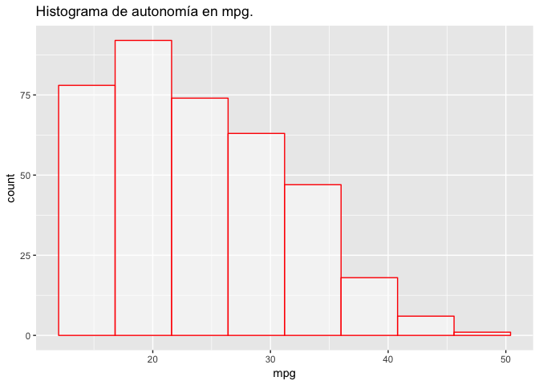
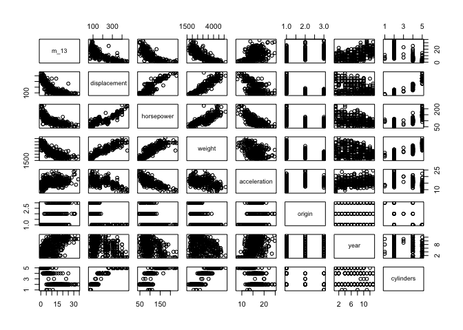
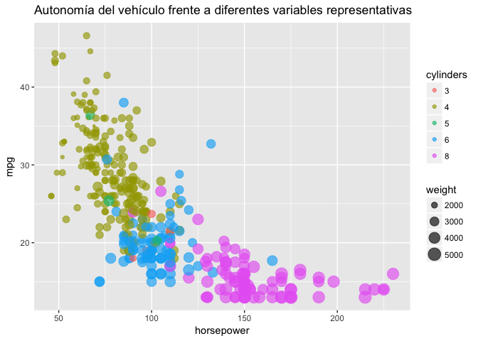
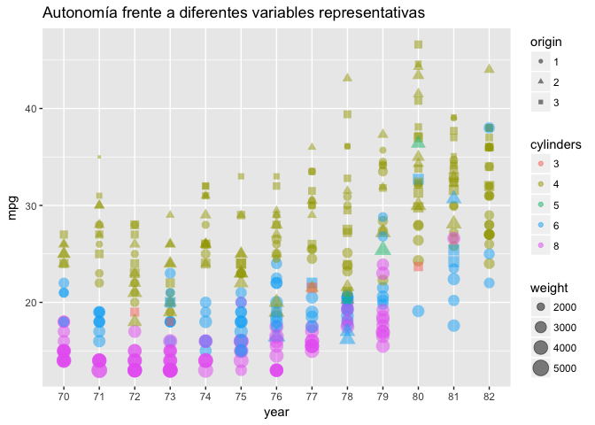

AEMOD. Entrega Auto
================
Miguel Ángel Berrocal
7/2/2017

Introducción.
-------------

En este ejercicio se hace uso del conjunto de datos "Auto", disponible en el paquete de R (ISLR)

En esta práctica se determinará un modelo que indentifique qúe varibles influyen en mayor y menor medida en el dato de consumo de combustible para una serie de vehículos, medido en millas por galón (mpg).

``` r
library(ISLR)
library(MASS)
library(ggplot2)
```

    ## Warning: package 'ggplot2' was built under R version 3.3.2

``` r
attach(Auto)
```

    ## The following object is masked from package:ggplot2:
    ## 
    ##     mpg

``` r
head(Auto)
```

    ##   mpg cylinders displacement horsepower weight acceleration year origin
    ## 1  18         8          307        130   3504         12.0   70      1
    ## 2  15         8          350        165   3693         11.5   70      1
    ## 3  18         8          318        150   3436         11.0   70      1
    ## 4  16         8          304        150   3433         12.0   70      1
    ## 5  17         8          302        140   3449         10.5   70      1
    ## 6  15         8          429        198   4341         10.0   70      1
    ##                        name
    ## 1 chevrolet chevelle malibu
    ## 2         buick skylark 320
    ## 3        plymouth satellite
    ## 4             amc rebel sst
    ## 5               ford torino
    ## 6          ford galaxie 500

Tratamiento de los datos y extracción de información:
-----------------------------------------------------

En el enunciado se propone eliminar del conjunto de datos aquellos vehículos con un gasto menor a 13 mpg. Además, se indica que hay considerar la variable salida mpg como variable de conteo, por lo que resulta de interés establecer el mínimo de consumo a 0 para que el recorrido de dicha variable empiece en 0. Al establecer el gasto en combustible como variable de conteo hay que redondear los datos.

A continuación, se aplican las recomendaciones indicadas.

    ##   m_13 mpg cylinders displacement horsepower weight acceleration year
    ## 1    5  18         8          307        130   3504         12.0   70
    ## 2    2  15         8          350        165   3693         11.5   70
    ## 3    5  18         8          318        150   3436         11.0   70
    ## 4    3  16         8          304        150   3433         12.0   70
    ## 5    4  17         8          302        140   3449         10.5   70
    ## 6    2  15         8          429        198   4341         10.0   70
    ##   origin                      name
    ## 1      1 chevrolet chevelle malibu
    ## 2      1         buick skylark 320
    ## 3      1        plymouth satellite
    ## 4      1             amc rebel sst
    ## 5      1               ford torino
    ## 6      1          ford galaxie 500

    ## 'data.frame':    379 obs. of  10 variables:
    ##  $ m_13        : num  5 2 5 3 4 2 1 1 1 2 ...
    ##  $ mpg         : num  18 15 18 16 17 15 14 14 14 15 ...
    ##  $ cylinders   : Ord.factor w/ 5 levels "3"<"4"<"5"<"6"<..: 5 5 5 5 5 5 5 5 5 5 ...
    ##  $ displacement: num  307 350 318 304 302 429 454 440 455 390 ...
    ##  $ horsepower  : num  130 165 150 150 140 198 220 215 225 190 ...
    ##  $ weight      : num  3504 3693 3436 3433 3449 ...
    ##  $ acceleration: num  12 11.5 11 12 10.5 10 9 8.5 10 8.5 ...
    ##  $ year        : Ord.factor w/ 13 levels "70"<"71"<"72"<..: 1 1 1 1 1 1 1 1 1 1 ...
    ##  $ origin      : Factor w/ 3 levels "1","2","3": 1 1 1 1 1 1 1 1 1 1 ...
    ##  $ name        : Factor w/ 304 levels "amc ambassador brougham",..: 49 36 231 14 161 141 54 223 241 2 ...



Con la instrucción **str**, se obtiene información sobre el conjunto de datos y el tipo de variables con las que se va a trabajar. Se ha cambiado el tipo de variable para "origin", que ha pasado de numérica a categórica, ya que representa el lugar de procedencia del vehículo. Por otro lado, se propone el cambio de las variables **year y cylinder** a tipo ordinal.

Una buena técnica para tener una impresión general sobre la relación de los diferentes atributos con la salida es usar la función **pairs**. Este comando genera un scatter plot que permite una rápida inspección de las relaciones comentadas.



Inspecionando el gráfico se observan ciertas relaciones. La autonomía decrece con el incremento de las variables **number of cylinders, displacement, weight, horsepower** , y aumenta con el incremento de las variables **acceleration y year**.

A continuación, se presenta un gráfico en el que se puede ver con claridad las relaciones de diferentes variables con el consumo de combustible.



Este gráfico resulta de gran interés debido a su simplicidad y alto contenido ilustrativo. En él se comprueba a simple vista la dependencia de las variables **cylinders, weight y horsepower** frente a la autonomía del vehículo. Dicha autonomía, en términos generales, disminuye con el aumento de número de cilindros, peso y caballos de potencia.

El número de cilindros es representado con una serie de colores. Para el caso del peso, se tiene que el diámetro del punto depende linealmente de los kilogramos.

Resulta inmediato sacar una serie de conclusiónes, por ejemplo, que, por regla general, aquellos coches que presentan una menor autonomía tienen 8 cilindros, más de 125 caballos de potencia y un peso mayor. Una correcta representación gráfica es una forma rápida y sencilla de verificar las conclusiones extraidas de apartados anteriores.



Si se reestructura la forma de presentar los gráficos y, además, se añade un factor de forma relacionado con el lugar de origen del vehículo, y se sustituye la variable **horsepower** por **year**, se obtiene el gráfico anterior. De él se pueden extraer numerosas conclusiones, siendo una de ellas que los vehículos que presentan menor autonomía media son aquellos con mayor peso y número de cilindros. En cuanto al origen y año de fabricación, consumen más aquellos construidos entre los años 70 y 76 y cuyo origen corresponde a la categoría 1.

Creación de modelos.
--------------------

Una vez estudiadas las principales variables y sus dependencias, se procede a la creación y comparación de los diferentes modelos estadísticos.

En este apartado, se van a crear diferentes modelos generalizados y se estudiará la importancia de las variables en cada caso. También se crearán modelos con interacción entre variables y se estudiará su validez.

Para ello, se va a tratar con la variable propuesta por el enunciado **m\_13** y se eliminará del conjunto de datos las variables **mpg y name**.

``` r
nuevos_datos <- datos_auto[-c(2,10)]
names(nuevos_datos)
```

    ## [1] "m_13"         "cylinders"    "displacement" "horsepower"  
    ## [5] "weight"       "acceleration" "year"         "origin"

### Consideraciones iniciales.

Tal y como se ha explicado en clase, los modelos adecuados para trabajar con una variable respuesta de tipo conteo son: el modelo de poisson y el modelo de binomial negativa. Si se tuviera un exceso de ceros, habría que recurrir a modelos ZAP o ZANB según el caso.

En este conjunto de datos no hay exceso de ceros, por los que los modelos ZAP y ZANB no serían los candidatos a ser aplicados. Para comprobar cuál es más adecuado usar de entre los dos restantes, se debe calcular la media y la varianza de la variable respuesta.

``` r
mean(nuevos_datos$m_13)
```

    ## [1] 10.8496

``` r
var(nuevos_datos$m_13)
```

    ## [1] 57.49319

El modelo de Poisson se caracteriza por tener su media igual a su varianza. Sin embargo, en muchos conjuntos de datos de conteo, la varianza es superior a la media. Este fenómeno se conoce como sobredispersión, y en estos casos es preferible usar la distribución binomial negativa.

En base a lo indicado, se observa que la varianza y la media de la variable respuesta no son iguales. Por tanto, la distribución más adecuada desde un punto de vista formal es la binomial negativa.

### Modelos lineales generalizados sin interacción entre variables.

Los difrenetes modelos serán generados con la función **glm.nb** ya que la librería glm de stats no incluye la familia binomial negativa. El criterio de comparación de modelos será a través de AIC, considerando "mejor" modelo aquel con menor AIC. Posteriormente, se realizará una comparación conjunta de los mejores modelos generados a través de la función anova. El criterio AIC, o Criterio de Información de Akaike, ofrece una medida de la calidad relativa de un modelo estadístico, dado un conjunto de datos.

El primer modelo se genera con todas la variables predictoras.

``` r
m0 <- glm.nb( m_13~., data = nuevos_datos)
```

    ## Warning in theta.ml(Y, mu, sum(w), w, limit = control$maxit, trace =
    ## control$trace > : iteration limit reached

    ## Warning in theta.ml(Y, mu, sum(w), w, limit = control$maxit, trace =
    ## control$trace > : iteration limit reached

``` r
summary(m0)
```

    ## 
    ## Call:
    ## glm.nb(formula = m_13 ~ ., data = nuevos_datos, init.theta = 138934.5852, 
    ##     link = log)
    ## 
    ## Deviance Residuals: 
    ##     Min       1Q   Median       3Q      Max  
    ## -2.8115  -0.5920  -0.0258   0.4212   3.7539  
    ## 
    ## Coefficients:
    ##                Estimate Std. Error z value Pr(>|z|)    
    ## (Intercept)   4.046e+00  2.411e-01  16.784  < 2e-16 ***
    ## cylinders.L   2.363e-01  1.901e-01   1.243  0.21376    
    ## cylinders.Q  -4.401e-01  1.460e-01  -3.015  0.00257 ** 
    ## cylinders.C   1.264e-01  7.232e-02   1.747  0.08055 .  
    ## cylinders^4  -7.826e-04  1.216e-01  -0.006  0.99487    
    ## displacement -1.707e-03  1.061e-03  -1.609  0.10753    
    ## horsepower   -3.599e-03  1.920e-03  -1.875  0.06085 .  
    ## weight       -4.880e-04  9.272e-05  -5.264 1.41e-07 ***
    ## acceleration  3.537e-03  9.754e-03   0.363  0.71690    
    ## year.L        8.483e-01  7.042e-02  12.047  < 2e-16 ***
    ## year.Q        2.022e-01  6.478e-02   3.122  0.00180 ** 
    ## year.C       -2.884e-01  6.471e-02  -4.457 8.32e-06 ***
    ## year^4       -1.431e-03  6.359e-02  -0.023  0.98204    
    ## year^5        1.528e-02  6.165e-02   0.248  0.80425    
    ## year^6       -1.819e-02  6.175e-02  -0.295  0.76829    
    ## year^7        1.882e-01  6.245e-02   3.013  0.00259 ** 
    ## year^8        2.213e-02  6.130e-02   0.361  0.71812    
    ## year^9       -5.892e-03  6.464e-02  -0.091  0.92737    
    ## year^10       7.447e-02  6.319e-02   1.179  0.23858    
    ## year^11      -1.130e-01  6.194e-02  -1.824  0.06810 .  
    ## year^12       4.903e-03  6.116e-02   0.080  0.93611    
    ## origin2       5.622e-02  5.003e-02   1.124  0.26108    
    ## origin3       3.471e-02  4.648e-02   0.747  0.45515    
    ## ---
    ## Signif. codes:  0 '***' 0.001 '**' 0.01 '*' 0.05 '.' 0.1 ' ' 1
    ## 
    ## (Dispersion parameter for Negative Binomial(138934.6) family taken to be 1)
    ## 
    ##     Null deviance: 2218.36  on 378  degrees of freedom
    ## Residual deviance:  281.12  on 356  degrees of freedom
    ## AIC: 1772.4
    ## 
    ## Number of Fisher Scoring iterations: 1
    ## 
    ## 
    ##               Theta:  138935 
    ##           Std. Err.:  700999 
    ## Warning while fitting theta: iteration limit reached 
    ## 
    ##  2 x log-likelihood:  -1724.429

En primera instancia, se observa que las variables menos significativas son **acceleration, displacement y origin**, siendo las más significativas, **weight, year, horsepower y cylinders**. Se ha llegado a esta afirmación mediante el estudio de los p-valores de las diferentes variables. Para aquellas con un p-valor &lt; 0.05, se rechaza la hipótesis nula, que indica que no son signifiativas al nivel de 95% de confianza. Para aquellas mayores de 0.05, sus altos p-valores no significan que no deben estar en el modelo, sino que hay otras variables que están correlacionadas con ellas y las hacen menos útiles para elaborar una predicción.

Mediante la función update, se va a iterar eliminando una de las variables menos significativas en cada paso. Por motivos de extensión, sólo se ha especificado la elmininación de aquella variable que aporta mayor mejora sobre el modelo de referencia con todas las variables predictoras.

``` r
m0_origin <- update(m0,.~.- origin)
```

    ## Warning in theta.ml(Y, mu, sum(w), w, limit = control$maxit, trace =
    ## control$trace > : iteration limit reached

    ## Warning in theta.ml(Y, mu, sum(w), w, limit = control$maxit, trace =
    ## control$trace > : iteration limit reached

``` r
summary(m0_origin)
```

    ## 
    ## Call:
    ## glm.nb(formula = m_13 ~ cylinders + displacement + horsepower + 
    ##     weight + acceleration + year, data = nuevos_datos, init.theta = 137174.4632, 
    ##     link = log)
    ## 
    ## Deviance Residuals: 
    ##     Min       1Q   Median       3Q      Max  
    ## -2.8220  -0.5810  -0.0441   0.4110   3.8620  
    ## 
    ## Coefficients:
    ##                Estimate Std. Error z value Pr(>|z|)    
    ## (Intercept)   4.111e+00  2.323e-01  17.693  < 2e-16 ***
    ## cylinders.L   2.817e-01  1.857e-01   1.517   0.1293    
    ## cylinders.Q  -4.455e-01  1.442e-01  -3.090   0.0020 ** 
    ## cylinders.C   1.387e-01  7.126e-02   1.946   0.0517 .  
    ## cylinders^4   1.991e-02  1.202e-01   0.166   0.8685    
    ## displacement -2.170e-03  9.786e-04  -2.218   0.0266 *  
    ## horsepower   -3.501e-03  1.890e-03  -1.853   0.0639 .  
    ## weight       -4.779e-04  9.057e-05  -5.276 1.32e-07 ***
    ## acceleration  3.600e-03  9.714e-03   0.371   0.7109    
    ## year.L        8.330e-01  6.780e-02  12.285  < 2e-16 ***
    ## year.Q        2.021e-01  6.475e-02   3.121   0.0018 ** 
    ## year.C       -2.923e-01  6.460e-02  -4.524 6.05e-06 ***
    ## year^4        1.055e-03  6.348e-02   0.017   0.9867    
    ## year^5        5.784e-03  6.101e-02   0.095   0.9245    
    ## year^6       -1.646e-02  6.151e-02  -0.268   0.7890    
    ## year^7        1.910e-01  6.238e-02   3.062   0.0022 ** 
    ## year^8        2.561e-02  6.121e-02   0.418   0.6756    
    ## year^9       -7.321e-05  6.443e-02  -0.001   0.9991    
    ## year^10       7.520e-02  6.281e-02   1.197   0.2312    
    ## year^11      -1.061e-01  6.163e-02  -1.722   0.0850 .  
    ## year^12       4.037e-03  6.116e-02   0.066   0.9474    
    ## ---
    ## Signif. codes:  0 '***' 0.001 '**' 0.01 '*' 0.05 '.' 0.1 ' ' 1
    ## 
    ## (Dispersion parameter for Negative Binomial(137174.5) family taken to be 1)
    ## 
    ##     Null deviance: 2218.4  on 378  degrees of freedom
    ## Residual deviance:  282.4  on 358  degrees of freedom
    ## AIC: 1769.7
    ## 
    ## Number of Fisher Scoring iterations: 1
    ## 
    ## 
    ##               Theta:  137174 
    ##           Std. Err.:  689542 
    ## Warning while fitting theta: iteration limit reached 
    ## 
    ##  2 x log-likelihood:  -1725.713

Partiendo del modelo anterior, m0\_origin, en el que se eliminó la variable **origin**, se aplica el mismo procedimiento eliminando una variable más, aquella que presente un menor nivel de significación. La variable predictora que menos explica a la variable respuesta es, en este caso, **acceleration**.

``` r
m0_origin_acceleration <- update(m0_origin,.~.- acceleration)
```

    ## Warning in theta.ml(Y, mu, sum(w), w, limit = control$maxit, trace =
    ## control$trace > : iteration limit reached

    ## Warning in theta.ml(Y, mu, sum(w), w, limit = control$maxit, trace =
    ## control$trace > : iteration limit reached

``` r
summary(m0_origin_acceleration)
```

    ## 
    ## Call:
    ## glm.nb(formula = m_13 ~ cylinders + displacement + horsepower + 
    ##     weight + year, data = nuevos_datos, init.theta = 136261.1953, 
    ##     link = log)
    ## 
    ## Deviance Residuals: 
    ##     Min       1Q   Median       3Q      Max  
    ## -2.8204  -0.5711  -0.0374   0.4145   3.8666  
    ## 
    ## Coefficients:
    ##                Estimate Std. Error z value Pr(>|z|)    
    ## (Intercept)   4.175e+00  1.564e-01  26.686  < 2e-16 ***
    ## cylinders.L   2.920e-01  1.836e-01   1.590  0.11186    
    ## cylinders.Q  -4.450e-01  1.442e-01  -3.086  0.00203 ** 
    ## cylinders.C   1.424e-01  7.052e-02   2.019  0.04344 *  
    ## cylinders^4   1.760e-02  1.201e-01   0.147  0.88346    
    ## displacement -2.245e-03  9.593e-04  -2.340  0.01929 *  
    ## horsepower   -3.993e-03  1.350e-03  -2.958  0.00309 ** 
    ## weight       -4.593e-04  7.561e-05  -6.075 1.24e-09 ***
    ## year.L        8.271e-01  6.591e-02  12.549  < 2e-16 ***
    ## year.Q        2.047e-01  6.434e-02   3.182  0.00146 ** 
    ## year.C       -2.911e-01  6.452e-02  -4.512 6.42e-06 ***
    ## year^4        7.718e-05  6.342e-02   0.001  0.99903    
    ## year^5        8.101e-03  6.069e-02   0.133  0.89382    
    ## year^6       -1.528e-02  6.142e-02  -0.249  0.80355    
    ## year^7        1.889e-01  6.211e-02   3.041  0.00236 ** 
    ## year^8        2.685e-02  6.112e-02   0.439  0.66051    
    ## year^9        1.990e-03  6.419e-02   0.031  0.97527    
    ## year^10       7.564e-02  6.279e-02   1.205  0.22838    
    ## year^11      -1.050e-01  6.155e-02  -1.706  0.08803 .  
    ## year^12       4.485e-03  6.115e-02   0.073  0.94153    
    ## ---
    ## Signif. codes:  0 '***' 0.001 '**' 0.01 '*' 0.05 '.' 0.1 ' ' 1
    ## 
    ## (Dispersion parameter for Negative Binomial(136261.2) family taken to be 1)
    ## 
    ##     Null deviance: 2218.36  on 378  degrees of freedom
    ## Residual deviance:  282.54  on 359  degrees of freedom
    ## AIC: 1767.9
    ## 
    ## Number of Fisher Scoring iterations: 1
    ## 
    ## 
    ##               Theta:  136261 
    ##           Std. Err.:  683489 
    ## Warning while fitting theta: iteration limit reached 
    ## 
    ##  2 x log-likelihood:  -1725.851

En este punto, se observa que todas las variables explicativas que quedan en el modelo son significativas, y que el AIC ha ido disminuyendo con cada una de las eliminaciones de varaibles propuestas. El siguiente paso es la inclusión de interacciones entre variables.

Previamente a la creación de estos términos, se va a proceder a comparar los modelos generados, para así verificar que las hipótesis establecidas son correctas. Para ello, se aplica el test chi cuadrado sobre los tres modelos generados.

``` r
anova(m0, m0_origin, m0_origin_acceleration,  test="Chisq")
```

    ## Likelihood ratio tests of Negative Binomial Models
    ## 
    ## Response: m_13
    ##                                                                           Model
    ## 1                         cylinders + displacement + horsepower + weight + year
    ## 2          cylinders + displacement + horsepower + weight + acceleration + year
    ## 3 cylinders + displacement + horsepower + weight + acceleration + year + origin
    ##      theta Resid. df    2 x log-lik.   Test    df  LR stat.   Pr(Chi)
    ## 1 136261.2       359       -1725.851                                 
    ## 2 137174.5       358       -1725.713 1 vs 2     1 0.1372589 0.7110214
    ## 3 138934.6       356       -1724.429 2 vs 3     2 1.2840404 0.5262283

A la vista de los resultados, se observa que el tanto el modelo m0, como m0\_origin, no presentan una mejora significativa sobre m0\_origin\_acceleration, dado que no se puede rechazar la hipótesis nula y. Por tanto, se ha optado por elegir el modelo con menos variables explicativas.

### Modelos lineales generalizados con interacción entre variables.

Partiendo del mejor modelo calculado anteriormente, **m0\_origin\_acceleration**, se va a proceder a generar nuevos modelos a partir de la interacción de las variables que lo conforman.

``` r
m0_interaccion <- glm.nb( m_13 ~ weight * horsepower + year + displacement + cylinders,
                          data=nuevos_datos)
```

    ## Warning in theta.ml(Y, mu, sum(w), w, limit = control$maxit, trace =
    ## control$trace > : iteration limit reached

    ## Warning in theta.ml(Y, mu, sum(w), w, limit = control$maxit, trace =
    ## control$trace > : iteration limit reached

``` r
summary(m0_interaccion)
```

    ## 
    ## Call:
    ## glm.nb(formula = m_13 ~ weight * horsepower + year + displacement + 
    ##     cylinders, data = nuevos_datos, init.theta = 106401.1324, 
    ##     link = log)
    ## 
    ## Deviance Residuals: 
    ##     Min       1Q   Median       3Q      Max  
    ## -3.1444  -0.5666  -0.0261   0.4046   3.7200  
    ## 
    ## Coefficients:
    ##                     Estimate Std. Error z value Pr(>|z|)    
    ## (Intercept)        3.408e+00  2.868e-01  11.880  < 2e-16 ***
    ## weight            -1.585e-04  1.219e-04  -1.300  0.19361    
    ## horsepower         6.320e-03  3.502e-03   1.805  0.07113 .  
    ## year.L             8.258e-01  6.587e-02  12.537  < 2e-16 ***
    ## year.Q             1.894e-01  6.445e-02   2.939  0.00330 ** 
    ## year.C            -2.804e-01  6.463e-02  -4.338 1.44e-05 ***
    ## year^4            -3.023e-03  6.343e-02  -0.048  0.96199    
    ## year^5             3.725e-03  6.072e-02   0.061  0.95109    
    ## year^6            -2.571e-02  6.154e-02  -0.418  0.67618    
    ## year^7             1.860e-01  6.211e-02   2.995  0.00274 ** 
    ## year^8             2.125e-02  6.114e-02   0.348  0.72811    
    ## year^9             1.981e-02  6.445e-02   0.307  0.75855    
    ## year^10            8.187e-02  6.284e-02   1.303  0.19266    
    ## year^11           -1.046e-01  6.156e-02  -1.698  0.08942 .  
    ## year^12            1.518e-02  6.122e-02   0.248  0.80422    
    ## displacement      -1.993e-03  9.640e-04  -2.068  0.03865 *  
    ## cylinders.L        4.735e-01  1.914e-01   2.474  0.01338 *  
    ## cylinders.Q       -3.084e-01  1.496e-01  -2.061  0.03934 *  
    ## cylinders.C        2.315e-01  7.537e-02   3.072  0.00213 ** 
    ## cylinders^4        2.838e-02  1.202e-01   0.236  0.81337    
    ## weight:horsepower -3.887e-06  1.224e-06  -3.175  0.00150 ** 
    ## ---
    ## Signif. codes:  0 '***' 0.001 '**' 0.01 '*' 0.05 '.' 0.1 ' ' 1
    ## 
    ## (Dispersion parameter for Negative Binomial(106401.1) family taken to be 1)
    ## 
    ##     Null deviance: 2218.31  on 378  degrees of freedom
    ## Residual deviance:  271.97  on 358  degrees of freedom
    ## AIC: 1759.3
    ## 
    ## Number of Fisher Scoring iterations: 1
    ## 
    ## 
    ##               Theta:  106401 
    ##           Std. Err.:  456495 
    ## Warning while fitting theta: iteration limit reached 
    ## 
    ##  2 x log-likelihood:  -1715.292

Al incluir el término de multiplicación de las variables **weight \* horsepower**, se produce una mejora del modelo, reduciéndose el valor de AIC: 1759.3

Por último, se van a introducir términos potencia de algunas de las variables explicativas.

``` r
m0_poly <- glm.nb( m_13~ poly(weight,2) + year + horsepower + cylinders + displacement,
                   data=nuevos_datos)
```

    ## Warning in theta.ml(Y, mu, sum(w), w, limit = control$maxit, trace =
    ## control$trace > : iteration limit reached

    ## Warning in theta.ml(Y, mu, sum(w), w, limit = control$maxit, trace =
    ## control$trace > : iteration limit reached

``` r
summary(m0_poly)
```

    ## 
    ## Call:
    ## glm.nb(formula = m_13 ~ poly(weight, 2) + year + horsepower + 
    ##     cylinders + displacement, data = nuevos_datos, init.theta = 124728.462, 
    ##     link = log)
    ## 
    ## Deviance Residuals: 
    ##     Min       1Q   Median       3Q      Max  
    ## -3.1858  -0.5595  -0.0383   0.4300   3.7378  
    ## 
    ## Coefficients:
    ##                    Estimate Std. Error z value Pr(>|z|)    
    ## (Intercept)       2.8864025  0.2011925  14.346  < 2e-16 ***
    ## poly(weight, 2)1 -9.5621926  1.3913872  -6.872 6.31e-12 ***
    ## poly(weight, 2)2 -1.9992161  0.6037071  -3.312 0.000928 ***
    ## year.L            0.8166616  0.0659965  12.374  < 2e-16 ***
    ## year.Q            0.1778349  0.0647563   2.746 0.006029 ** 
    ## year.C           -0.2748071  0.0647492  -4.244 2.19e-05 ***
    ## year^4           -0.0069577  0.0634778  -0.110 0.912720    
    ## year^5            0.0222292  0.0608471   0.365 0.714866    
    ## year^6           -0.0462087  0.0621032  -0.744 0.456838    
    ## year^7            0.2008246  0.0621799   3.230 0.001239 ** 
    ## year^8            0.0121975  0.0612693   0.199 0.842199    
    ## year^9            0.0140109  0.0643227   0.218 0.827568    
    ## year^10           0.0803857  0.0628354   1.279 0.200789    
    ## year^11          -0.1219788  0.0617823  -1.974 0.048344 *  
    ## year^12           0.0087696  0.0611476   0.143 0.885961    
    ## horsepower       -0.0048779  0.0013753  -3.547 0.000390 ***
    ## cylinders.L       0.4792629  0.1906453   2.514 0.011940 *  
    ## cylinders.Q      -0.3077598  0.1491913  -2.063 0.039127 *  
    ## cylinders.C       0.2177322  0.0737529   2.952 0.003155 ** 
    ## cylinders^4       0.0393279  0.1202786   0.327 0.743688    
    ## displacement     -0.0022158  0.0009578  -2.313 0.020705 *  
    ## ---
    ## Signif. codes:  0 '***' 0.001 '**' 0.01 '*' 0.05 '.' 0.1 ' ' 1
    ## 
    ## (Dispersion parameter for Negative Binomial(124728.5) family taken to be 1)
    ## 
    ##     Null deviance: 2218.34  on 378  degrees of freedom
    ## Residual deviance:  271.22  on 358  degrees of freedom
    ## AIC: 1758.5
    ## 
    ## Number of Fisher Scoring iterations: 1
    ## 
    ## 
    ##               Theta:  124728 
    ##           Std. Err.:  576538 
    ## Warning while fitting theta: iteration limit reached 
    ## 
    ##  2 x log-likelihood:  -1714.539

Por simplicidad, se ha mostrado el modelo cuya combinación de términos de potencia, generan un menor valor de AIC, y por tanto, un mejor resultado atendiendo al criterio de evaluación propuesto.

``` r
modelos = c ("Completo", "Eliminando origin", "Emininando origin y acceleration", 
           "Con interacción", "Polinómico")

res = c(m0$deviance, m0_origin$deviance, m0_origin_acceleration$deviance, 
        m0_interaccion$deviance, m0_poly$deviance)

aic = c(m0$aic, m0_origin$aic, m0_origin_acceleration$aic, m0_interaccion$aic, m0_poly$aic)
tabla = cbind("Modelos"=modelos, "Devianza de residuos"= res, "AIC"=aic)

knitr::kable(as.data.frame( tabla), format = "latex",align='l', 
             caption = "Tabla de resultados")
```

Como conclusión, y siguiendo el criterio comentado, se tomará el modelo denominado como **Polinómico** como candidato, al ser el que mejor explica la variable respuesta y tiene un valor de AIC más bajo.
