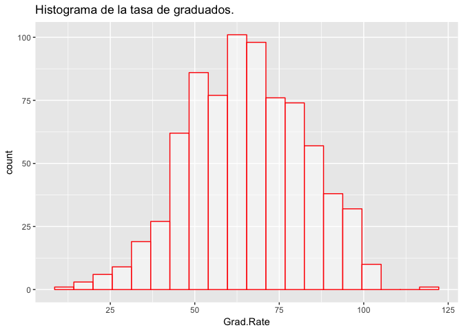
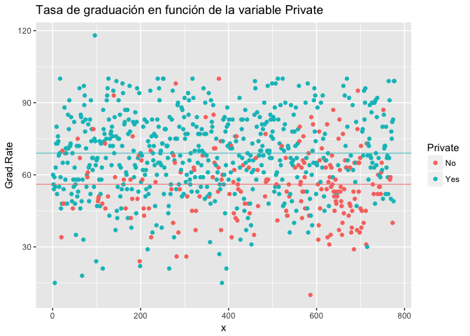
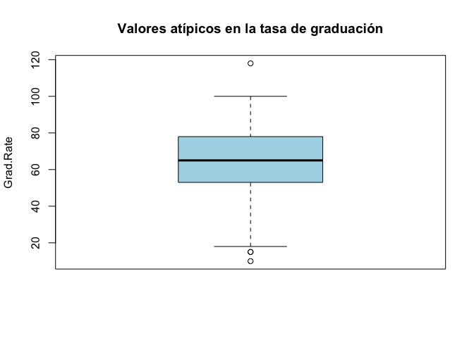
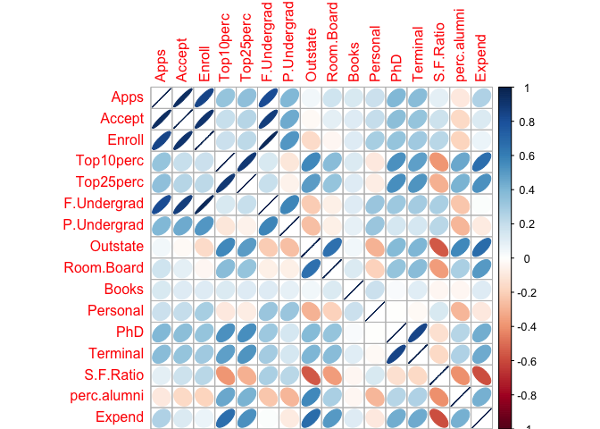
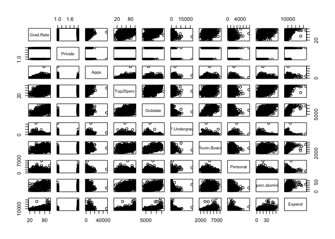
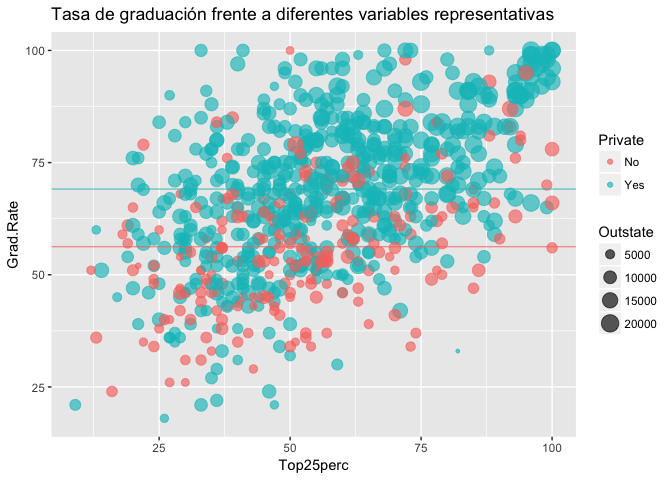
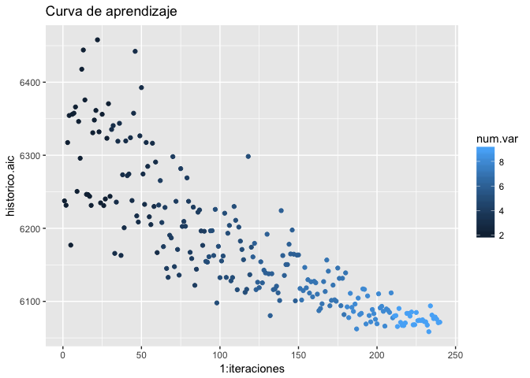
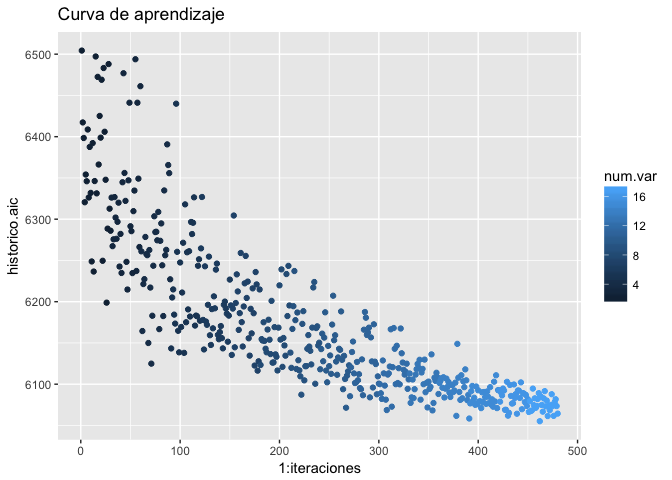

AEMOD Entrega College
================
Miguel Ángel Berrocal
12/2/2017

Introducción.
-------------

En este ejercicio se hace uso del conjunto de datos "College", disponible en el paquete de R (ISLR)

En esta práctica se determinará un modelo tipo gam para la variable respuesta **GradRate**, eligiendo la función más adecuada para cada variable predictora. La valoración de los modelos se realizará a través del Criterio de Información de Akaike (AIC), tal y como se procedió en el problema anterior (Autos).

``` r
library(ISLR)
library(gam)
library(ggplot2)
library(corrplot)
library(car)
```

``` r
str(College)
```

    ## 'data.frame':    777 obs. of  18 variables:
    ##  $ Private    : Factor w/ 2 levels "No","Yes": 2 2 2 2 2 2 2 2 2 2 ...
    ##  $ Apps       : num  1660 2186 1428 417 193 ...
    ##  $ Accept     : num  1232 1924 1097 349 146 ...
    ##  $ Enroll     : num  721 512 336 137 55 158 103 489 227 172 ...
    ##  $ Top10perc  : num  23 16 22 60 16 38 17 37 30 21 ...
    ##  $ Top25perc  : num  52 29 50 89 44 62 45 68 63 44 ...
    ##  $ F.Undergrad: num  2885 2683 1036 510 249 ...
    ##  $ P.Undergrad: num  537 1227 99 63 869 ...
    ##  $ Outstate   : num  7440 12280 11250 12960 7560 ...
    ##  $ Room.Board : num  3300 6450 3750 5450 4120 ...
    ##  $ Books      : num  450 750 400 450 800 500 500 450 300 660 ...
    ##  $ Personal   : num  2200 1500 1165 875 1500 ...
    ##  $ PhD        : num  70 29 53 92 76 67 90 89 79 40 ...
    ##  $ Terminal   : num  78 30 66 97 72 73 93 100 84 41 ...
    ##  $ S.F.Ratio  : num  18.1 12.2 12.9 7.7 11.9 9.4 11.5 13.7 11.3 11.5 ...
    ##  $ perc.alumni: num  12 16 30 37 2 11 26 37 23 15 ...
    ##  $ Expend     : num  7041 10527 8735 19016 10922 ...
    ##  $ Grad.Rate  : num  60 56 54 59 15 55 63 73 80 52 ...

``` r
attach(College)
```

El conjunto de datos está constituido por 777 observaciones con 18 variables predictoras. La variable **Private** es de tipo factor, mientras que el resto de variables son de tipo numéricas. Si se desea obtener información adicional de cada variable, ejecutar la instrucción **?College**.

A continuación, se muestra el significado de cada una de ellas.

### Variables explicativas.

**Private**: A factor with levels No and Yes indicating private or public university

**Apps**: Number of applications received

**Accept**: Number of applications accepted

**Enroll**: Number of new students enrolled

**Top10perc**: Pct. new students from top 10% of H.S. class

**Top25perc**: Pct. new students from top 25% of H.S. class

**F.Undergrad**: Number of fulltime undergraduates

**P.Undergrad**: Number of parttime undergraduates

**Outstate**: Out-of-state tuition

**Room.Board**: Room and board costs

**Books**: Estimated book costs

**Personal**: Estimated personal spending

**PhD**: Pct. of faculty with Ph.D.'s

**Terminal**: Pct. of faculty with terminal degree

**S.F.Ratio**: Student/faculty ratio

**perc.alumni**: Pct. alumni who donate

**Expend**:Instructional expenditure per student

### Variable respuesta:

**Grad.Rate**:Graduation rate

Análisis de los datos.
----------------------

Una vez introducido el problema, se pasa a estudiar la distribución de la variable respuesta. Para ello se representa su histograma.

``` r
p <- ggplot(College, aes(x=Grad.Rate)) + 
  geom_histogram(position = "identity", col= "red", fill="white", alpha = 0.5, bins= 20)

p + ggtitle("Histograma de la tasa de graduados.")
```



A la vista del histograma se aprecia que la variable respuesta, **Grad.Rate**, sigue una distribución parecida a una normal. Para contrastarlo, se usa el test de normalidad de Shapiro Wilk.

``` r
shapiro.test(College$Grad.Rate)
```

    ## 
    ##  Shapiro-Wilk normality test
    ## 
    ## data:  College$Grad.Rate
    ## W = 0.9948, p-value = 0.009424

Se recuerda que el test plantea como hipótesis nula que una muestra X1,...,Xn proviene de una población normalmente distribuida. En este caso, como el p-valor resultante es menor que 0.05, se rechaza la hipótesis nula, y por tanto, no se puede asegurar que las muestras sigan una distribución normal.

Por otro lado, se tiene que **Private** es una variable categórica, y la variable respuesta podría ser susceptible de presentar valores diferentes en función de si una universidad es pública o privada. La siguiente figura presenta un gráfico de puntos donde se representa la tasa de graduación para todos los casos, discriminando por la variable **Private**

``` r
x <- array(1:length(College$Grad.Rate))

privados=which(College$Private=="Yes")
d_priv=College[privados,"Grad.Rate"]
publicos=which(College$Private=="No")
d_pub=College[publicos,"Grad.Rate"]

a<-qplot(x,Grad.Rate, data = College, colour = Private,
      main = "Tasa de graduación en función de la variable Private")

a + geom_hline(yintercept = c(mean(d_priv), mean(d_pub)), 
               colour=c("#1FBFC3","#F57670"), alpha=I(0.65))
```



Si bien es cierto que hay mas casos de universidades privadas que públicas y que la tasa de graduación en las universidades privadas es mayor, la variable **Private** no es determinante a la hora de establecer un tasa de graduación, y por tanto, no parece sensato dividir a la población en dos subconjuntos discriminando por esta variable.

Eliminación de valores atípicos y selección de variables.
---------------------------------------------------------

Sobre el gráfico, se puede observar la existencia de varios casos atípicos que podrían resultar de interés eliminarlos del conjuto de datos. Para detectar estos valores atípicos y averiguar sus índices se ejecuta la siguiente instrucción:

### Localización y eliminación de outliers.

``` r
outliers <- boxplot(College$Grad.Rate, main='Valores atípicos en la tasa de graduación', 
                    ylab='Grad.Rate', col = 'lightblue')
```



``` r
# Valores atípicos
values <- outliers$out
(indices <- which(College$Grad.Rate %in% values))
```

    ## [1]   5  96 385 586

``` r
# Nuevos datos con los outliers eliminados
datos_sin_outliers <- College[-indices,]
str(datos_sin_outliers)
```

    ## 'data.frame':    773 obs. of  18 variables:
    ##  $ Private    : Factor w/ 2 levels "No","Yes": 2 2 2 2 2 2 2 2 2 2 ...
    ##  $ Apps       : num  1660 2186 1428 417 587 ...
    ##  $ Accept     : num  1232 1924 1097 349 479 ...
    ##  $ Enroll     : num  721 512 336 137 158 103 489 227 172 472 ...
    ##  $ Top10perc  : num  23 16 22 60 38 17 37 30 21 37 ...
    ##  $ Top25perc  : num  52 29 50 89 62 45 68 63 44 75 ...
    ##  $ F.Undergrad: num  2885 2683 1036 510 678 ...
    ##  $ P.Undergrad: num  537 1227 99 63 41 ...
    ##  $ Outstate   : num  7440 12280 11250 12960 13500 ...
    ##  $ Room.Board : num  3300 6450 3750 5450 3335 ...
    ##  $ Books      : num  450 750 400 450 500 500 450 300 660 500 ...
    ##  $ Personal   : num  2200 1500 1165 875 675 ...
    ##  $ PhD        : num  70 29 53 92 67 90 89 79 40 82 ...
    ##  $ Terminal   : num  78 30 66 97 73 93 100 84 41 88 ...
    ##  $ S.F.Ratio  : num  18.1 12.2 12.9 7.7 9.4 11.5 13.7 11.3 11.5 11.3 ...
    ##  $ perc.alumni: num  12 16 30 37 11 26 37 23 15 31 ...
    ##  $ Expend     : num  7041 10527 8735 19016 9727 ...
    ##  $ Grad.Rate  : num  60 56 54 59 55 63 73 80 52 73 ...

Una vez eliminados los casos atípicos, se procederá a determinar la correlación entre las variables que componen el modelo para poder determinar la relevancias de éstas y poder establecer un criterio de selección. La función **corrplot** permite visualizar de forma cómoda la matriz de correlaciones entre variables.

### Localización y eliminación de variables correlacionadas.

``` r
# Se deja fuera la variable respuesta y Private por ser categórica
corr_matrix <- cor(datos_sin_outliers[,-c(1,18)])
corrplot(corr_matrix,method="ellipse")
```



Se genera también un modelo lineal, a través del cuál se podrá estimar la importancia relativa de las variables, y junto con la imagen anterior, tomar las variables de partida más adecuadas para generar los modelos.

``` r
modelo_completo=lm(Grad.Rate~.,data=datos_sin_outliers)
summary(modelo_completo)
```

    ## 
    ## Call:
    ## lm(formula = Grad.Rate ~ ., data = datos_sin_outliers)
    ## 
    ## Residuals:
    ##     Min      1Q  Median      3Q     Max 
    ## -44.639  -7.116  -0.354   7.131  48.546 
    ## 
    ## Coefficients:
    ##               Estimate Std. Error t value Pr(>|t|)    
    ## (Intercept) 32.4448181  4.7003421   6.903 1.08e-11 ***
    ## PrivateYes   3.2674878  1.6456321   1.986 0.047444 *  
    ## Apps         0.0015076  0.0004283   3.520 0.000457 ***
    ## Accept      -0.0014946  0.0008436  -1.772 0.076832 .  
    ## Enroll       0.0053347  0.0023291   2.290 0.022270 *  
    ## Top10perc   -0.0114160  0.0705131  -0.162 0.871429    
    ## Top25perc    0.1855557  0.0542934   3.418 0.000665 ***
    ## F.Undergrad -0.0008989  0.0004009  -2.242 0.025257 *  
    ## P.Undergrad -0.0013848  0.0003783  -3.660 0.000270 ***
    ## Outstate     0.0010800  0.0002262   4.774 2.16e-06 ***
    ## Room.Board   0.0017748  0.0005716   3.105 0.001972 ** 
    ## Books       -0.0018081  0.0028259  -0.640 0.522481    
    ## Personal    -0.0013816  0.0007475  -1.848 0.064939 .  
    ## PhD          0.1138217  0.0552965   2.058 0.039895 *  
    ## Terminal    -0.0915215  0.0603066  -1.518 0.129533    
    ## S.F.Ratio    0.0620101  0.1540551   0.403 0.687416    
    ## perc.alumni  0.2577184  0.0476930   5.404 8.76e-08 ***
    ## Expend      -0.0004486  0.0001493  -3.004 0.002754 ** 
    ## ---
    ## Signif. codes:  0 '***' 0.001 '**' 0.01 '*' 0.05 '.' 0.1 ' ' 1
    ## 
    ## Residual standard error: 12.32 on 755 degrees of freedom
    ## Multiple R-squared:  0.4744, Adjusted R-squared:  0.4626 
    ## F-statistic: 40.09 on 17 and 755 DF,  p-value: < 2.2e-16

Con la información que se dispone, y tomando como criterio que las variables susceptibles de ser eliminidas del modelo son aquellas que presentan una correlación &gt;= 0.85 en valor absoluto y son menos significativas, se ha decidido eliminar las siguientes variables explicativas: **Terminal, F.Undergrad, Top10perc, Accept y Enroll**. Además, se van a eliminar aquellas con un nivel de significación bajo, como **books, S.F. Ratio y PhD**

``` r
datos_utiles = datos_sin_outliers[,-c(3,4,5,7,11,13,14,15)]
names(datos_utiles)
```

    ##  [1] "Private"     "Apps"        "Top25perc"   "P.Undergrad" "Outstate"   
    ##  [6] "Room.Board"  "Personal"    "perc.alumni" "Expend"      "Grad.Rate"

``` r
modelo_reducido=lm(Grad.Rate~.,data=datos_utiles)
summary(modelo_reducido)
```

    ## 
    ## Call:
    ## lm(formula = Grad.Rate ~ ., data = datos_utiles)
    ## 
    ## Residuals:
    ##     Min      1Q  Median      3Q     Max 
    ## -45.289  -7.301  -0.537   7.060  50.905 
    ## 
    ## Coefficients:
    ##               Estimate Std. Error t value Pr(>|t|)    
    ## (Intercept) 32.7569492  2.4899450  13.156  < 2e-16 ***
    ## PrivateYes   3.2413583  1.4839592   2.184  0.02925 *  
    ## Apps         0.0008359  0.0001565   5.341 1.22e-07 ***
    ## Top25perc    0.1890161  0.0297251   6.359 3.50e-10 ***
    ## P.Undergrad -0.0015963  0.0003510  -4.548 6.31e-06 ***
    ## Outstate     0.0010522  0.0002141   4.915 1.09e-06 ***
    ## Room.Board   0.0016855  0.0005568   3.027  0.00255 ** 
    ## Personal    -0.0015514  0.0007303  -2.124  0.03396 *  
    ## perc.alumni  0.2723395  0.0470435   5.789 1.03e-08 ***
    ## Expend      -0.0003825  0.0001256  -3.046  0.00240 ** 
    ## ---
    ## Signif. codes:  0 '***' 0.001 '**' 0.01 '*' 0.05 '.' 0.1 ' ' 1
    ## 
    ## Residual standard error: 12.37 on 763 degrees of freedom
    ## Multiple R-squared:  0.4649, Adjusted R-squared:  0.4586 
    ## F-statistic: 73.65 on 9 and 763 DF,  p-value: < 2.2e-16

Al eliminar las variables propuestas se ha reducido considerablemente el número de variables predictoras, quedando, sin embargo, un valor de R^2 muy cercano al que se tenía en el modelo con todas las variables.

### Visualización de las variables seleccionadas y la relación entre ellas.

En este punto, se puede representar un gráfico de puntos en el que se midan las relaciones entre los diferentes pares de variables. Como se puede comprobar, no hay una dependencia clara entre ningún par, debido al proceso de selección realizado en los apartados anteriores.

``` r
pairs(~Grad.Rate + Private + Apps + Top25perc + Outstate + P.Undergrad + Room.Board 
      + Personal + perc.alumni + Expend  , data=datos_utiles)
```



A continuación, se presenta un gráfico para facilitar la compresión de cómo se relacionan varias de las variables explicativas con la variable respuesta.

``` r
p <- qplot(Top25perc, Grad.Rate, data = datos_utiles, col= Private, size= Outstate, 
           alpha = I(0.65),
           main = "Tasa de graduación frente a diferentes variables representativas") 

privados=which(datos_utiles$Private=="Yes")
d_priv=datos_utiles[privados,"Grad.Rate"]
publicos=which(datos_utiles$Private=="No")
d_pub=datos_utiles[publicos,"Grad.Rate"]

p + geom_hline(yintercept = c(mean(d_priv), mean(d_pub)), 
               colour=c("#1FBFC3","#F57670"), alpha=I(0.65))
```



Sobre la figura anterior se pueden sacar ciertas consideraciones. Como se comentó anteriormente, se corrobora que la variable **Private** no resulta tan discriminante como para tratar las dos categorías que la componen de forma separada. También se encuentra cierta relación con la variable **Outstate**, amentando la tasa de graduados conforme aumenta esta variable.

Aplicación de los modelos.
--------------------------

En este último paso, se trata de averiguar qué función es la más adecuada para cada variable predictora de las seleccionadas. Las funciones a aplicar serán splines y polinómicas, denotadas en como **s** y **poly** respectivamente. Los grados posibles que van a tomar las variables está comprendidos entre 0 y 4. Para el caso de grado = 0, no se aplicará ninguna función a la variable implicada.

Para la selección de las funciones adecuadas, se propone un algoritmo constructivo e iterativo que permite generar combinaciones aleatorias de las funciones propuestas y sus grados, y aplicarlas a las diferentes variables.

Este algoritmo surge de la necesidad de generar difentes combinaciones de selección de variables y aplicación de funciones, ya que, a priori, no se puede establecer un método secuencial que asegure la combinación óptima de dichos parámetros, o de poder realizarse, sería muy costoso computacionalmente.

Se ha decidido implementar el método en este paso, dado que las tareas previa como el estudio de las variables y la selección de atributos no tienen un carácter aleatorio y se debe realizar justificando las decisiones tomadas de forma analítica.

En primer lugar, se elimina la variable respuesta de las candidatas a ser implementadas en el modelo. Se tendrán, por tanto, 9 variables con las que hacer combinaciones.

``` r
# Creación del modelo de trabajo eliminando la variable respuesta
datos_modelo <- datos_utiles[,-c(10)]
n_var = length(datos_modelo)
```

Se ha denominado método constructivo e iterativo por las siguientes razones:

**Constructivo**: El algoritmo construye modelos crecientes en complejidad, comenzando por dos variables y finalizando con todas (9).

**Iterativo**: Para cada iteración en la que se seleccionan **i** variables, se generan **j** modelos aleatorios. Randomizando el tipo de función a aplicar, su grado y el orden de inclusión de las variables.

Inicialmente, se parte de dos variables. Para estas variables se generan 30 modelos aleatorios. Para cada modelo, se toman las variables de forma aleatoria, tal que los 30 modelos aleatorios de dos variables no estén formados siempre por las mismas. Para cada variable seleccionada, se elige de forma aleatoria si se le aplica una función de tipo splin o polinómica, además, también se determina su grado. En el caso de que el grado seleccionado sea cero, a esa variable no se le aplica función alguna.

Una vez generado el modelo, se toma su valor AIC y se compara con el mejor valor obtenido con los modelos anteriores. Si el nuevo valor es el mejor encontrado hasta ese momento, se almacena y se toma su AIC como el de referencia. Para facilitar su compresión, se ha guardado el histórico de los valores AIC para su posterior representación gráfica a modo de curva de aprendizaje.

Una vez generados y evaluados los 30 modelos de 2 variables, se incrementa en 1 el número de variables a incluir en el siguiente modelo y se repite el proceso anterior. El algoritmo termina cuando se han incluido todas las variables del modelo reducido (9).

``` r
# Inicialización de las variables.
best_score = Inf
iteraciones = 0
historico.aic = 0
historico.var.numbers = 0
primero = 1

# Se introducen las variables al modelo de una en una. Se comienza con 2 variables
for  (i in 2:n_var){
  
  # Se realiza el proceso 30 veces para que se generen un buen numero de combinaciones
  for (j in 1:30){
  
    # Se recoge una muestra desordenada de tamaño i
    muestra <-sample(1:n_var,n_var,replace=FALSE)[1:i]
    # Se seleccionan las columnas correspondientes a la muestra generada
    names_muestra = names(datos_modelo)[muestra]
    
    # Para cada variable se elige si se aplica splines o poly y su grado
    vars = ""
    for (v in 1:i){
      
        # Si dice = 1 uso splines, sino uso poly
        dice = sample(c("s","poly"), 1)
        # Indica el grado del polinomio generado
        grade = sample(0:4, 1)
      
      # Si la variable es Private o el grado es 0 no se aplica ninguna función
      if (names_muestra[v] == "Private" || grade == 0){
        var = names_muestra[v]
      }else{
        if (dice == "s"){
          var = paste("s(",names_muestra[v],",",grade,")", sep = "")
        }else{ 
          var = paste("poly(",names_muestra[v],",",grade,")", sep = "")
        }
      }
      # Si no es la última variable del modelo se añade el símbolo +
      if (v < i){
        vars = paste(vars, var," + ", sep = "")
      }else{
        vars = paste(vars, var, sep = "")
      }
    }
    # Generación de la sentencia a aplicar en el modelo
    model_vars = paste("Grad.Rate ~ ", vars)
    # Ejecución del modelo
    expresion = as.formula(model_vars)
    model = gam(expresion, data=datos_utiles)
    
    # Almacenamiento de los valores AIC
    iteraciones = iteraciones + 1 
   
     if (primero==1){
      historico.aic = model$aic
      iteracion = 1
      num.var = i
      primero = 0
      
    }else{
      historico.aic = rbind(historico.aic,model$aic)
      num.var = rbind(num.var,i)
    }
    
    # Si el modelo ejecutado es mejor que el almacenado, se actualiza el mejor modelo.
    if (model$aic < best_score){
      best_score = model$aic
      best_model = model
      best_index = iteraciones
    }
  }
}
```

Una vez aplicado el algoritmo, se tiene que el mejor modelo resultante, entendiendo como mejor aquel con menor AIC es el siguiente:

``` r
# AIC del mejor modelo
best_score
```

    ## [1] 6058.521

``` r
# Fórmula del mejor modelo
best_model$formula
```

    ## Grad.Rate ~ Private + perc.alumni + poly(P.Undergrad, 2) + s(Top25perc, 
    ##     4) + s(Personal, 3) + s(Expend, 4) + s(Apps, 3) + Room.Board + 
    ##     s(Outstate, 4)

Por último, se representa la curva de aprendizaje del algoritmo, donde se observa la tendencia de mejora conforme el aumento de número de variables en el modelo. El color de cada punto depende del número de variables incluidas en el modelo, siendo más oscuro cuanto menor número de variables implicadas.

``` r
qplot(1:iteraciones, historico.aic, col=num.var, main= "Curva de aprendizaje") 
```



Para verificar finalmente que las variables propuestas son las más adecuadas, a modo de justificación, se va a repetir el proceso anterior, pero esta vez con todas las variables.

``` r
# Inicialización de las variables.
datos_modelo <- datos_sin_outliers[,-c(18)]
n_var = length(datos_modelo)

best_score = Inf
iteraciones = 0
historico.aic = 0
historico.var.numbers = 0
primero = 1

# Se introducen las variables al modelo de una en una. Se comienza con 2 variables
for  (i in 2:n_var){
  
  # Se realiza el proceso 30 veces para que se generen un buen numero de combinaciones
  for (j in 1:30){
  
    # Se recoge una muestra desordenada de tamaño i
    muestra <-sample(1:n_var,n_var,replace=FALSE)[1:i]
    # Se selecciona las columnas correspondientes a la muestra genera
    names_muestra = names(datos_modelo)[muestra]
    
    # Para cada variable se elige si se aplica splines o poly y su grado
    vars = ""
    for (v in 1:i){
      
        # Si dice = 1 uso splines, sino uso poly
        dice = sample(c("s","poly"), 1)
        # Indica el grado del polinomio generado
        grade = sample(0:4, 1)
      
      # Si la variable es Private o el grado es 0 no se aplica ninguna función
      if (names_muestra[v] == "Private" || grade == 0){
        var = names_muestra[v]
      }else{
        if (dice == "s"){
          var = paste("s(",names_muestra[v],",",grade,")", sep = "")
        }else{ 
          var = paste("poly(",names_muestra[v],",",grade,")", sep = "")
        }
      }
      # Si no es la última variable del modelo se añade el símbolo +
      if (v < i){
        vars = paste(vars, var," + ", sep = "")
      }else{
        vars = paste(vars, var, sep = "")
      }
    }
    # Generación de la sentencia a aplicar en el modelo
    model_vars = paste("Grad.Rate ~ ", vars)
    # Ejecución del modelo
    expresion = as.formula(model_vars)
    model = gam(expresion, data=datos_sin_outliers)
    
    # Almacenamiento de los valores AIC
    iteraciones = iteraciones + 1 
   
     if (primero==1){
      historico.aic = model$aic
      iteracion = 1
      num.var = i
      primero = 0
      
    }else{
      historico.aic = rbind(historico.aic,model$aic)
      #iteracion = rbind(iteracion,iteraciones)
      num.var = rbind(num.var,i)
    }
    
    # Si el modelo ejecutados es mejor que el almacenado, se actualiza el mejor modelo.
    if (model$aic < best_score){
      best_score = model$aic
      best_model = model
    }
  }
}

# Valor del mejor modelo
best_score
```

    ## [1] 6055.151

``` r
# Fórmula del mejor modelo
best_model$formula
```

    ## Grad.Rate ~ s(PhD, 1) + s(Top25perc, 3) + s(Personal, 1) + P.Undergrad + 
    ##     s(Expend, 4) + poly(Books, 3) + poly(Top10perc, 1) + poly(Outstate, 
    ##     2) + Private + poly(Terminal, 1) + s(Accept, 2) + poly(S.F.Ratio, 
    ##     1) + s(perc.alumni, 4) + s(F.Undergrad, 4) + s(Room.Board, 
    ##     4) + poly(Enroll, 1) + poly(Apps, 3)

``` r
qplot(1:iteraciones, historico.aic, col=num.var, main= "Curva de aprendizaje")
```



Como se comprueba con el valor AIC, el modelo generado con todas las variables no mejora de forma significativa al descrito en el aparatado anterior, al cual se le aplicó la selección de variables.

Como conclusión, se extrae que con la simple aplicación de un algoritmo estilo Montecarlo, se facilita al investigador la tarea de seleccionar las mejores funciones para cada variable. Este método de búsqueda podría mejorarse mediante la aplicación de meteheurísticas tales como algoritmos genéticos o búsqueda tabú, sin embargo, para conjuntos de datos con pocas variables no resulta necesario.
