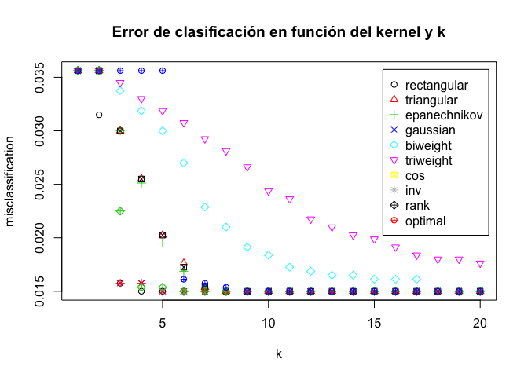
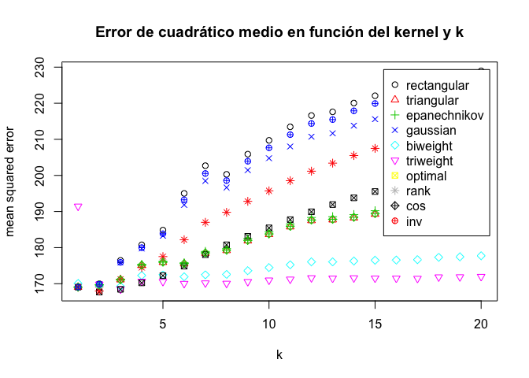
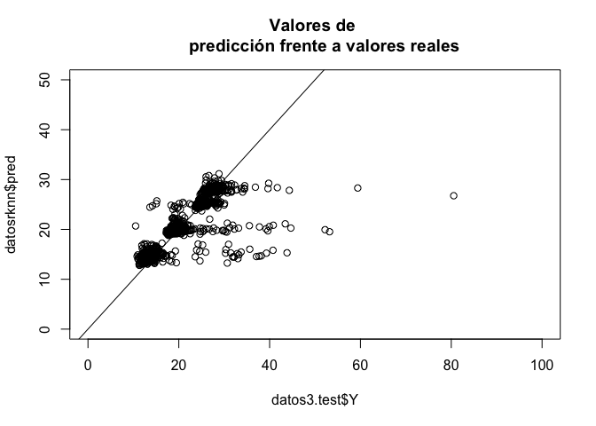
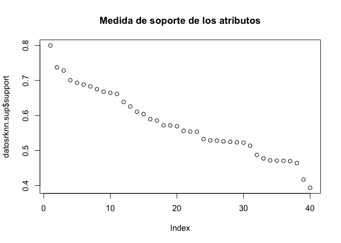
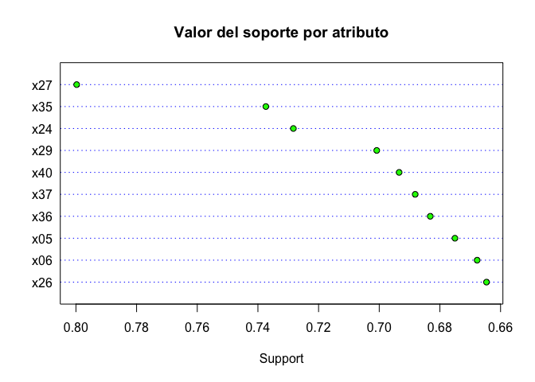
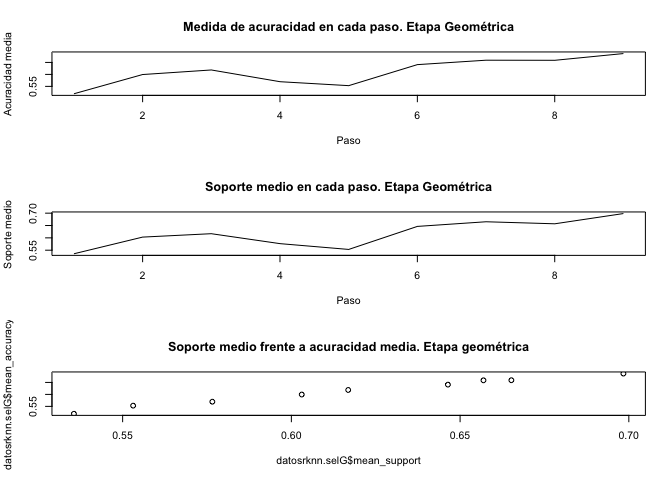
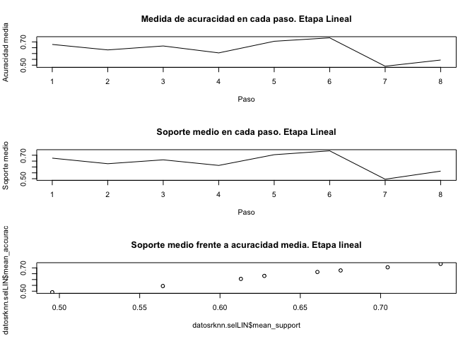
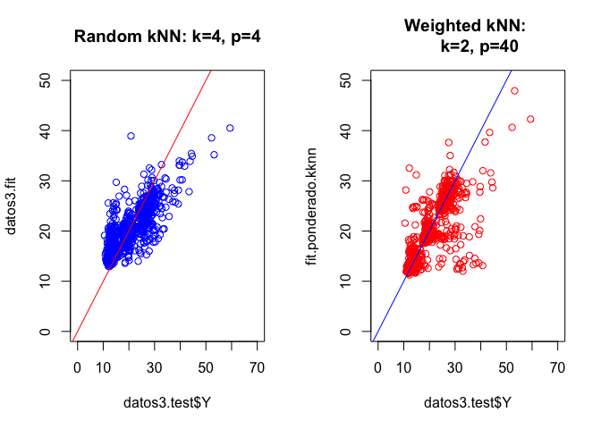

Entrega AEM: Regresión y clasificación mediante kNN
================
Miguel Ángel Berrocal
29/1/2017

Problema de clasificación.
--------------------------

### Determinación de un clasificador basado en kNN ponderado para la variable objetivo “clasobj” con los atributos x01...x40.

En primer lugar, se carga el conjunto de datos y se hace una breve visualización de las variables que intervienen, así como su dimensión. Además, resulta de utilidad la obtención de un resumen básico que del conjunto de datos para hacerse una idea de la distibución, tipo y recorrido de las diferentes variables.

``` r
datos <- read.table("datawork.csv", header=TRUE, sep=";")
dim(datos)
```

    ## [1] 4000   42

``` r
names(datos)
```

    ##  [1] "clasobj" "varobj"  "x01"     "x02"     "x03"     "x04"     "x05"    
    ##  [8] "x06"     "x07"     "x08"     "x09"     "x10"     "x11"     "x12"    
    ## [15] "x13"     "x14"     "x15"     "x16"     "x17"     "x18"     "x19"    
    ## [22] "x20"     "x21"     "x22"     "x23"     "x24"     "x25"     "x26"    
    ## [29] "x27"     "x28"     "x29"     "x30"     "x31"     "x32"     "x33"    
    ## [36] "x34"     "x35"     "x36"     "x37"     "x38"     "x39"     "x40"

``` r
summary(datos)
```

    ##  clasobj       varobj            x01              x02        
    ##  AA: 626   Min.   : 10.49   Min.   :0.0700   Min.   :0.1300  
    ##  BB:1315   1st Qu.: 14.35   1st Qu.:0.4000   1st Qu.:0.5100  
    ##  CC:1372   Median : 19.34   Median :0.5000   Median :0.6000  
    ##  DD: 687   Mean   : 20.86   Mean   :0.4989   Mean   :0.5977  
    ##            3rd Qu.: 25.48   3rd Qu.:0.6000   3rd Qu.:0.7000  
    ##            Max.   :713.81   Max.   :0.9400   Max.   :0.9300  
    ##       x03              x04             x05              x06       
    ##  Min.   :  0.94   Min.   :-0.64   Min.   :  2.96   Min.   :0.080  
    ##  1st Qu.: 15.55   1st Qu.:21.56   1st Qu.: 69.82   1st Qu.:0.660  
    ##  Median : 25.98   Median :29.54   Median : 94.06   Median :0.940  
    ##  Mean   : 30.42   Mean   :29.48   Mean   : 93.91   Mean   :1.015  
    ##  3rd Qu.: 40.17   3rd Qu.:37.34   3rd Qu.:117.63   3rd Qu.:1.270  
    ##  Max.   :166.17   Max.   :62.67   Max.   :194.56   Max.   :3.260  
    ##       x07              x08                x09                x10         
    ##  Min.   :  3.61   Min.   :    0.02   Min.   :   0.000   Min.   : 0.0000  
    ##  1st Qu.: 51.86   1st Qu.:    5.58   1st Qu.:   1.147   1st Qu.: 0.1000  
    ##  Median : 83.12   Median :   21.86   Median :   2.020   Median : 0.2500  
    ##  Mean   : 96.34   Mean   :  162.95   Mean   :   4.502   Mean   : 0.4398  
    ##  3rd Qu.:125.90   3rd Qu.:   80.82   3rd Qu.:   3.480   3rd Qu.: 0.5700  
    ##  Max.   :502.70   Max.   :68676.15   Max.   :1097.640   Max.   :24.1800  
    ##       x11               x12             x13             x14       
    ##  Min.   :  0.490   Min.   :10.57   Min.   : 9.26   Min.   :10.21  
    ##  1st Qu.:  2.158   1st Qu.:15.45   1st Qu.:15.45   1st Qu.:15.40  
    ##  Median :  2.960   Median :17.66   Median :17.60   Median :17.65  
    ##  Mean   :  4.197   Mean   :17.56   Mean   :17.58   Mean   :17.57  
    ##  3rd Qu.:  4.152   3rd Qu.:19.70   3rd Qu.:19.70   3rd Qu.:19.69  
    ##  Max.   :688.530   Max.   :25.16   Max.   :24.86   Max.   :24.64  
    ##       x15             x16             x17             x18       
    ##  Min.   :10.15   Min.   : 9.65   Min.   :10.13   Min.   :10.47  
    ##  1st Qu.:15.42   1st Qu.:15.37   1st Qu.:15.46   1st Qu.:15.43  
    ##  Median :17.58   Median :17.55   Median :17.60   Median :17.62  
    ##  Mean   :17.55   Mean   :17.55   Mean   :17.57   Mean   :17.57  
    ##  3rd Qu.:19.68   3rd Qu.:19.66   3rd Qu.:19.67   3rd Qu.:19.67  
    ##  Max.   :24.73   Max.   :25.50   Max.   :25.15   Max.   :25.22  
    ##       x19             x20             x21             x22       
    ##  Min.   :10.06   Min.   :10.26   Min.   : 9.59   Min.   : 9.44  
    ##  1st Qu.:15.44   1st Qu.:15.37   1st Qu.:15.45   1st Qu.:15.39  
    ##  Median :17.61   Median :17.66   Median :17.58   Median :17.63  
    ##  Mean   :17.58   Mean   :17.58   Mean   :17.54   Mean   :17.57  
    ##  3rd Qu.:19.72   3rd Qu.:19.67   3rd Qu.:19.63   3rd Qu.:19.71  
    ##  Max.   :25.08   Max.   :24.95   Max.   :25.09   Max.   :24.99  
    ##       x23             x24             x25             x26       
    ##  Min.   : 9.99   Min.   : 9.63   Min.   : 9.03   Min.   : 9.89  
    ##  1st Qu.:15.47   1st Qu.:15.41   1st Qu.:15.44   1st Qu.:15.39  
    ##  Median :17.59   Median :17.50   Median :17.64   Median :17.59  
    ##  Mean   :17.57   Mean   :17.55   Mean   :17.55   Mean   :17.59  
    ##  3rd Qu.:19.66   3rd Qu.:19.70   3rd Qu.:19.75   3rd Qu.:19.73  
    ##  Max.   :25.29   Max.   :25.15   Max.   :24.95   Max.   :25.05  
    ##       x27             x28             x29             x30       
    ##  Min.   : 5.91   Min.   : 7.81   Min.   :0.020   Min.   :10.00  
    ##  1st Qu.:15.23   1st Qu.:15.92   1st Qu.:0.250   1st Qu.:14.00  
    ##  Median :17.74   Median :18.41   Median :0.360   Median :16.00  
    ##  Mean   :17.78   Mean   :18.47   Mean   :0.375   Mean   :16.76  
    ##  3rd Qu.:20.36   3rd Qu.:21.14   3rd Qu.:0.490   3rd Qu.:19.00  
    ##  Max.   :47.94   Max.   :28.27   Max.   :0.920   Max.   :29.00  
    ##       x31              x32              x33             x34        
    ##  Min.   : 75.25   Min.   : 79.55   Min.   : 81.6   Min.   : 83.37  
    ##  1st Qu.:119.00   1st Qu.:118.01   1st Qu.:118.2   1st Qu.:132.24  
    ##  Median :135.91   Median :134.82   Median :135.5   Median :151.30  
    ##  Mean   :135.30   Mean   :133.66   Mean   :134.2   Mean   :150.74  
    ##  3rd Qu.:151.52   3rd Qu.:149.53   3rd Qu.:150.0   3rd Qu.:169.27  
    ##  Max.   :191.41   Max.   :185.77   Max.   :189.7   Max.   :241.19  
    ##       x35             x36              x37              x38       
    ##  Min.   : 75.3   Min.   : 35.80   Min.   :-26.19   Min.   :203.3  
    ##  1st Qu.:119.4   1st Qu.: 63.55   1st Qu.: 10.10   1st Qu.:326.0  
    ##  Median :136.8   Median : 73.68   Median : 19.36   Median :374.3  
    ##  Mean   :136.5   Mean   : 73.64   Mean   : 19.57   Mean   :372.6  
    ##  3rd Qu.:154.4   3rd Qu.: 83.84   3rd Qu.: 28.77   3rd Qu.:418.2  
    ##  Max.   :197.3   Max.   :110.56   Max.   :206.12   Max.   :534.5  
    ##       x39             x40       
    ##  Min.   :210.2   Min.   :226.3  
    ##  1st Qu.:312.5   1st Qu.:349.1  
    ##  Median :357.7   Median :398.4  
    ##  Mean   :355.8   Mean   :397.5  
    ##  3rd Qu.:397.9   3rd Qu.:446.0  
    ##  Max.   :493.2   Max.   :553.8

En efecto, se tiene un conjunto de datos con 40 variables explicativas y 2 variables respuesta diferentes, que se usarán para predecir o clasificar según el caso. Todas las variables explicativas son de tipo numérico, no existiendo en este caso variables de tipo categórico u ordinal.

A continuación, se ha de seleccionar aleatoriamente un conjunto test de tamaño n/3 y un conjunto de aprendizaje de tamaño 2n/3. Para ello se seleccionan todas las variables predictoras, comprendidas en el intervalo x0...x40.

``` r
set.seed(2017)
m <- dim(datos)[1]
# Generación de los índices de las muestras.
sample <- sample(1:m, size = round(m/3), replace = FALSE,prob = rep(1/m, m)) 
# Se elimina la variable varobj del conjunto de datos.
datos1 =datos[,-c(2)]
names(datos1)
```

    ##  [1] "clasobj" "x01"     "x02"     "x03"     "x04"     "x05"     "x06"    
    ##  [8] "x07"     "x08"     "x09"     "x10"     "x11"     "x12"     "x13"    
    ## [15] "x14"     "x15"     "x16"     "x17"     "x18"     "x19"     "x20"    
    ## [22] "x21"     "x22"     "x23"     "x24"     "x25"     "x26"     "x27"    
    ## [29] "x28"     "x29"     "x30"     "x31"     "x32"     "x33"     "x34"    
    ## [36] "x35"     "x36"     "x37"     "x38"     "x39"     "x40"

``` r
# Creación de los datos de entrenamiento.
datos1.train <- datos1[-sample,]
dim(datos1.train)
```

    ## [1] 2667   41

``` r
# Creación de los datos de test.
datos1.test <- datos1[sample,]
dim(datos1.test)
```

    ## [1] 1333   41

Se verifica que los conjuntos de test y entrenamiento se han generado satisfactoriamente. Se ha eliminado también la variable respuesta "varobj", ya que en este problema se atenderá excusivamente a la clasificación de la variable respuesta "clasobj".

### Con el conjunto de aprendizaje, selecciona el mejor núcleo y el mejor k (entre 1 y 20) a través de validación cruzada.

``` r
(fit.train <- train.kknn(clasobj ~ ., datos1.train, kmax = 20,
                          kernel = c("rectangular", "triangular", "epanechnikov",
                                     "gaussian","biweight","triweight","cos","inv", 
                                     "rank", "optimal"), distance = 1))
```

    ## 
    ## Call:
    ## train.kknn(formula = clasobj ~ ., data = datos1.train, kmax = 20,     distance = 1, kernel = c("rectangular", "triangular", "epanechnikov",         "gaussian", "biweight", "triweight", "cos", "inv", "rank",         "optimal"))
    ## 
    ## Type of response variable: nominal
    ## Minimal misclassification: 0.01499813
    ## Best kernel: rectangular
    ## Best k: 4

Se aplica el método de entrenamiento de **validación cruzada** sobre el conjunto de datos train con los diferentes kernels y valores de k, y se obtiene que la **mejor combinación** (kernel, k) es (kernel = rectangular, k = 4). En este caso, el método de validación cruzada utilizado es **leave one out**. El error de clasificación obtenido con estos valores es de 0.01499813

A continuación, se realizan las predicciones sobre conjunto de test, se comparan con los valores reales y se obtiene la matriz de confusión.

``` r
table(predict(fit.train, datos1.test), datos1.test$clasobj)
```

    ##     
    ##       AA  BB  CC  DD
    ##   AA 207   0   1   4
    ##   BB   1 446  10   2
    ##   CC   0   5 433   2
    ##   DD   0   0   0 222

Como se puede observar, los resultados obtenidos con el clasificador parecen razonablemente buenos. Tan solo ha errado al clasificar 25 casos de los 1333 contemplados en el conjunto de datos destinados al test.

En las siguentes líneas se exponen una serie de resultados, asociados a difrentes medidas de error durante el proceso de selección de kernel y número de vecinos.

``` r
# Matriz de errores de clasificación (para los distintos núcleos y valores de k). Solo se
# muestran los 4 primeros valores de k por cuestión de espacio
fit.train$MISCLASS[1:4,]
```

    ##   rectangular triangular epanechnikov   gaussian   biweight  triweight
    ## 1  0.03562055 0.03562055   0.03562055 0.03562055 0.03562055 0.03562055
    ## 2  0.03149606 0.03562055   0.03562055 0.03562055 0.03562055 0.03562055
    ## 3  0.01574803 0.02999625   0.02999625 0.01574803 0.03374578 0.03449569
    ## 4  0.01499813 0.02549681   0.02512186 0.01574803 0.03187102 0.03299588
    ##          cos        inv       rank    optimal
    ## 1 0.03562055 0.03562055 0.03562055 0.03562055
    ## 2 0.03562055 0.03562055 0.03562055 0.03562055
    ## 3 0.02999625 0.01574803 0.02249719 0.03562055
    ## 4 0.02549681 0.01574803 0.01537308 0.03562055

``` r
# Listado de predicciones para la primera combinación de función núcleo y valores de k. 
# Omitido por una extensión excesiva.
# fit.train$fitted.values[1]
# Mejores parámetros para función núcleo y valor k 
fit.train$best.parameters 
```

    ## $kernel
    ## [1] "rectangular"
    ## 
    ## $k
    ## [1] 4

``` r
# Tipo de variable respuesta (continua, ordinal, norminal)
fit.train$response
```

    ## [1] "nominal"

``` r
# Parámetro de la distancia de Minkowski
fit.train$distance       
```

    ## [1] 1

``` r
plot(fit.train, main="Error de clasificación en función del kernel y k")
```



Con el apoyo del gráfico, se reconoce facilmente que aquellos kernels que dan mejores resultados son: "rectangular","inv" y "rank". En cuanto al los valores de k, se aprecia claramente que a partir de k=4, el error del clasificador se mantiene constante y cercano al 1,2%. Este es un buen modelo también desde el punto de vista computacional, ya que se consiguen buenos resultados con un reducido número de vecinos y con una función kernel rectangular, que lo hace ser no ponderado.

Podemos proceder a realizar el mismo procedimiento de este apartado con una normalización a la unidad de todo el conjunto de datos y comprobar si éste afecta al resultado. En esta ocasión solo será comentado el resultado final.

``` r
datos2 =datos[,-c(2)]
# Normalización del conjunto de datos a la unidad.
datos2 = data.frame(normalize.unit(datos2[,c(-1)]),Y=datos2$clasobj)
# Verificación de la normalización.
head(datos2)
```

    ##          x01    x02        x03       x04       x05        x06       x07
    ## 1 0.65517241 0.6875 0.14597833 0.5379877 0.5230689 0.31446541 0.1535996
    ## 2 0.72413793 0.7375 0.09162985 0.1835413 0.1844990 0.48427673 0.1076159
    ## 3 0.43678161 0.7250 0.34400533 0.7804454 0.7580898 0.08176101 0.3424833
    ## 4 0.09195402 0.5375 0.10197906 0.1686937 0.1428497 0.24528302 0.1078563
    ## 5 0.72413793 0.5125 0.10010289 0.4130469 0.4147182 0.30188679 0.1080767
    ## 6 0.34482759 0.7750 0.29697997 0.5195072 0.5038100 0.26415094 0.3002464
    ##            x08         x09         x10         x11        x12       x13
    ## 1 2.156499e-04 0.016480813 0.008271299 0.003328295 0.48389308 0.6185897
    ## 2 4.470258e-04 0.015606210 0.004135649 0.001802221 0.09732694 0.4019231
    ## 3 7.382478e-04 0.002478044 0.019023987 0.006278705 0.75531186 0.7692308
    ## 4 2.438256e-03 0.021036041 0.014888337 0.003560839 0.14873201 0.2346154
    ## 5 5.840457e-04 0.001548777 0.007857734 0.002514389 0.35572310 0.5211538
    ## 6 2.737487e-05 0.001603440 0.006203474 0.004302075 0.58464702 0.6083333
    ##         x14       x15       x16       x17       x18       x19       x20
    ## 1 0.7498267 0.5843621 0.5564669 0.5252996 0.5972881 0.5652463 0.5636487
    ## 2 0.1940402 0.1659808 0.1589905 0.1704394 0.2237288 0.1338216 0.2770592
    ## 3 0.9348579 0.7119342 0.8574132 0.7303595 0.6847458 0.7902796 0.8039483
    ## 4 0.1247401 0.1790123 0.1621451 0.1877497 0.3166102 0.1691079 0.1484003
    ## 5 0.3742204 0.3024691 0.3848580 0.4853529 0.2183051 0.4400799 0.5302927
    ## 6 0.6992377 0.5240055 0.5343849 0.7057257 0.6901695 0.6957390 0.6861811
    ##          x21       x22        x23       x24       x25       x26       x27
    ## 1 0.57548387 0.5427653 0.54575163 0.6391753 0.6086683 0.6048813 0.3518915
    ## 2 0.05225806 0.3022508 0.09738562 0.1256443 0.2028894 0.2935356 0.2624316
    ## 3 0.98838710 0.8385852 0.78954248 0.9117268 0.8146985 0.7434037 0.3518915
    ## 4 0.19419355 0.2823151 0.27712418 0.1288660 0.2663317 0.2559367 0.2281704
    ## 5 0.38451613 0.4372990 0.34052288 0.3324742 0.4189698 0.3245383 0.2039020
    ## 6 0.58709677 0.6456592 0.56993464 0.6533505 0.5741206 0.7387863 0.3744944
    ##         x28       x29        x30        x31       x32       x33       x34
    ## 1 0.5840665 0.6555556 0.57894737 0.60476928 0.5115797 0.6048641 0.5490432
    ## 2 0.2570870 0.5777778 0.21052632 0.06895661 0.1885709 0.1159608 0.1855278
    ## 3 0.6583578 0.3333333 0.52631579 0.97976928 0.8791188 0.8327168 0.6929413
    ## 4 0.3514174 0.4888889 0.05263158 0.13782713 0.1617398 0.2469946 0.1699404
    ## 5 0.5224829 0.3111111 0.36842105 0.37896006 0.4014310 0.2889773 0.2631479
    ## 6 0.6050831 0.2555556 0.36842105 0.62594697 0.5659951 0.6738487 0.5856039
    ##         x35       x36       x37        x38       x39       x40  Y
    ## 1 0.5463782 0.6276986 0.3282683 0.58596322 0.6470755 0.5773564 CC
    ## 2 0.1379056 0.3259142 0.2728682 0.06837194 0.2335748 0.2643583 AA
    ## 3 0.7602425 0.6768947 0.1535018 0.94186573 0.8500088 0.8523404 DD
    ## 4 0.2345952 0.2710735 0.2201369 0.12587201 0.1827885 0.2677475 AA
    ## 5 0.4065880 0.3569193 0.1677500 0.42859300 0.3024563 0.4013923 BB
    ## 6 0.5990659 0.7099329 0.2579312 0.59626129 0.6981799 0.7537174 CC

``` r
# Creación de los datos de entrenamiento con las mismas muestras del apartado anterior.
datos2.train <- datos2[-sample,]
# Creación de los datos de test
datos2.test <- datos2[sample,]

(fit.train <- train.kknn(Y ~ ., datos2.train, kmax = 20,
                          kernel = c("rectangular", "triangular", "epanechnikov",
                                     "gaussian","biweight","triweight","cos","inv",
                                     "rank", "optimal"), distance = 1))
```

    ## 
    ## Call:
    ## train.kknn(formula = Y ~ ., data = datos2.train, kmax = 20, distance = 1,     kernel = c("rectangular", "triangular", "epanechnikov", "gaussian",         "biweight", "triweight", "cos", "inv", "rank", "optimal"))
    ## 
    ## Type of response variable: nominal
    ## Minimal misclassification: 0.01499813
    ## Best kernel: rectangular
    ## Best k: 4

Como se puede comprobar, los mejores parámetros tanto de kernel como el valor de k no han variado. Además el error de clasificación es el mismo, con lo que el proceso de normalización de los datos no aporta una ventaja respecto al anterior en este caso.

Problema de regresión.
----------------------

### Determinación de un predictor basado en kNN ponderado para la variable objetivo “varobj” con los atributos x01...x40.

Tal y como se procedió en el apartado anterior, se ha de seleccionar aleatoriamente un conjunto test de tamaño n/3 y un conjunto de aprendizaje de tamaño 2n/3. En este caso, la variable respuesta pasa a ser "varobj"

``` r
set.seed(2017)
m <- dim(datos)[1]
# Selección de los datos.
datos3 =datos[,-c(1)]
# Normalización de los datos.
datos3 = data.frame(normalize.unit(datos3[,c(-1)]),Y=datos3$varobj)
names(datos3)
```

    ##  [1] "x01" "x02" "x03" "x04" "x05" "x06" "x07" "x08" "x09" "x10" "x11"
    ## [12] "x12" "x13" "x14" "x15" "x16" "x17" "x18" "x19" "x20" "x21" "x22"
    ## [23] "x23" "x24" "x25" "x26" "x27" "x28" "x29" "x30" "x31" "x32" "x33"
    ## [34] "x34" "x35" "x36" "x37" "x38" "x39" "x40" "Y"

``` r
# Generación de los índices de las muestras.
sample <- sample(1:m, size = round(m/3), replace = FALSE,prob = rep(1/m, m)) 
# Creación de los datos de entrenamiento
datos3.train <- datos3[-sample,]
dim(datos3.train)
```

    ## [1] 2667   41

``` r
# Creación de los datos de test
datos3.test <- datos3[sample,]
dim(datos3.test)
```

    ## [1] 1333   41

### Aplicar el predictor óptimo obtenido para predecir los casos del conjunto test y obtener una medida del error de predicción.

Una vez se han seleccionado y separado los datos en un conjunto de entrenamiento y test, se procede a la creación del modelo knn ponderado.

``` r
(fit.train2 <- train.kknn(Y ~ ., datos3.train, kmax = 20, scale="FALSE",
                          kernel = c( "rectangular","triangular", "epanechnikov", 
                                      "gaussian","biweight","triweight", "optimal","rank",
                                      "cos","inv"), distance = 2))
```

    ## 
    ## Call:
    ## train.kknn(formula = Y ~ ., data = datos3.train, kmax = 20, distance = 2,     kernel = c("rectangular", "triangular", "epanechnikov", "gaussian",         "biweight", "triweight", "optimal", "rank", "cos", "inv"),     scale = "FALSE")
    ## 
    ## Type of response variable: continuous
    ## minimal mean absolute error: 2.415471
    ## Minimal mean squared error: 167.6904
    ## Best kernel: optimal
    ## Best k: 2

``` r
plot(fit.train2, main="Error de cuadrático medio en función del kernel y k")
```



En este caso, el kernel que mejor se adapta es el de tipo "optimal" con k = 2. A la vista del gráfico se verifica este resultado. El error cuadrático medio resultante es 167.6904

Se verifican los cálculos, valores y estimaciones generados en proceso anterior mediante las siguientes instrucciones.

``` r
names(fit.train2)
```

    ##  [1] "MISCLASS"        "MEAN.ABS"        "MEAN.SQU"       
    ##  [4] "fitted.values"   "best.parameters" "response"       
    ##  [7] "distance"        "call"            "terms"          
    ## [10] "data"

``` r
fit.train2$best.parameters # Mejores parámetros para función núcleo y valor k 
```

    ## $kernel
    ## [1] "optimal"
    ## 
    ## $k
    ## [1] 2

``` r
fit.train2$response        # Tipo de variable respuesta (continua, ordinal, norminal)
```

    ## [1] "continuous"

``` r
fit.train2$distance        # Parámetro de la distancia de Minkowski.
```

    ## [1] 2

``` r
# Error de ajuste en el regresor óptimo.
fit.train2$MEAN.SQU[fit.train2$best.parameters$k,fit.train2$best.parameters$kernel]
```

    ## [1] 167.6904

### Determinación de un predictor basado en kNN aleatorio para la variable objetivo “varobj” con los atributos x01...x40.

En este apartado se procede al cálculo de un predictor basado en kNN aleatorio para estimar los valores de la variable objetivo "varobj". Posteriormente se le aplicarán al modelo resultante las técnicas de selección de atributos vistas en clase.

``` r
(p=ncol(datos)-1)
```

    ## [1] 41

``` r
m=10
(rnc=r(p,m,eta=0.99,method="binomial"))
```

    ## [1] 30

Se tienen 40 variables predictoras y 1 variable respuesta. Se ha tomado m=10 como número de variables predictoras a incuir en el modelo. Para una probabilidad de presencia de las variables en el modelo de un 99%, se tiene un r=30. Es decir, se generan 30 modelos de 10 variables seleccionadas aleatoriamente de forma iterativa y la respuesta se estima en base a esta combinación.

``` r
#Aplicación de rkNN para k=4 y r=40 (superior al mínimo necesario para eta=0.99)
datosrknn = rknnReg(data=datos3.train[,c(-41)],datos3.test[,c(-41)], y=datos3.train$Y, 
                    k = 4, r=40, mtry = m , seed=2017)
```

En este paso se ha creado el modelo kNN aleatorio a partir de 40 modelos con 10 variables cada uno. Se ha omitido la salida del modelo por cuestiones de extensión de la memoria, pero en las siguientes instrucciones se presentan los parámetros mas interesantes.

``` r
datosrknn$k    # Número de vecinos utilizados en los clasificadores
```

    ## [1] 4

``` r
datosrknn$r    # Número de clasificadores
```

    ## [1] 40

``` r
datosrknn$mtry # Número de atributos en cada clasificador
```

    ## [1] 10

``` r
datosrknn$p    # Número de atributos
```

    ## [1] 40

``` r
# Error cuadrático medio para knn aleatorio
(MSE_knn_random = sum((datosrknn$pred-datos3.test$Y)^2/dim(datos3.test)[1]))
```

    ## [1] 17.46932

``` r
plot(datos3.test$Y,datosrknn$pred,xlim=c(0,100),ylim=c(0,50), main = "Valores de 
    predicción frente a valores reales")
abline(a=0,b=1)
```



En el gráfico se representan los valores de la variable respuesta predichos por el modelo en comparación con los valores reales del conjunto de test. Se puede observar que, en media, la mayoría de las predicciones toman un valor cercano a su valor real, sin embargo, se da la existencia de ciertos casos en los que el regresor no se ajusta con precisión.

A continuación se procede a la aplicación del un método de selección de variables. Este, permite simplificar el modelo y eliminar de él variables que puedan añadir algún tipo de ruido.

En el paso anterior se han normalizado los datos, se ha obtenido el valor de "r" para un "m" dado y se ha generado el modelo rkNN. Para determinar la relevancia de los atributos, se aplica la medida de soporte sobre las difentes variables. Esta medida servirá como criterio para la posterior selección en función de su importancia.

``` r
datosrknn.sup = rknnRegSupport(data = datos3.train[,c(-41)], y=datos3.train$Y, 
                               k = 4, r=40, mtry = m , seed=2017)

print(datosrknn.sup)
```

    ## 
    ## Call:
    ## rknnRegSupport(data = datos3.train[, c(-41)], y = datos3.train$Y,
    ## k = 4, r = 40, mtry = m, seed = 2017)
    ## 
    ## Number of knns:  40 
    ## No. of variables used for each knn:  10 
    ## Accuracy: 0.1999566

``` r
datosrknn.sup$accuracy  # Medida de la acuracidad del método
```

    ## [1] 0.1999566

``` r
datosrknn.sup$meanacc   # Acuracidad media de los r clasificadores generados
```

    ## [1] 0.5724302

``` r
datosrknn.sup$support   # Vector (dimensión p) de las medidas "soporte" de los atributos
```

    ##       x27       x35       x24       x29       x40       x37       x36 
    ## 0.7997557 0.7373822 0.7283131 0.7008241 0.6934427 0.6881470 0.6831747 
    ##       x05       x06       x26       x30       x34       x11       x32 
    ## 0.6750375 0.6677208 0.6646336 0.6615121 0.6386778 0.6256443 0.6104870 
    ##       x25       x16       x38       x09       x28       x03       x20 
    ## 0.6040328 0.5893308 0.5856187 0.5720619 0.5717392 0.5692815 0.5563115 
    ##       x01       x19       x33       x23       x18       x31       x39 
    ## 0.5541647 0.5537428 0.5325476 0.5288994 0.5283170 0.5263205 0.5249205 
    ##       x17       x12       x13       x21       x15       x07       x22 
    ## 0.5233282 0.5223481 0.5136893 0.4873847 0.4774720 0.4719741 0.4709952 
    ##       x04       x08       x10       x02       x14 
    ## 0.4706134 0.4695196 0.4639496 0.4169601 0.3937209

``` r
mean(datosrknn.sup$support)
```

    ## [1] 0.5763499

``` r
summary(datosrknn.sup$support)
```

    ##    Min. 1st Qu.  Median    Mean 3rd Qu.    Max. 
    ##  0.3937  0.5202  0.5628  0.5763  0.6623  0.7998

``` r
# Gráficos de las medidas soporte de los atributos
plot(datosrknn.sup$support, main="Medida de soporte de los atributos")
```



``` r
# Plot de los 10 atributos más importates según la medida soporte
plot(datosrknn.sup, n.var= 10, main = "Valor del soporte por atributo",
     bg = "green", lcolor="blue") 
```



Las medidas de precisión o acuracidad se realizan a través del método de crosvalidación **leave one out** sobre el conjunto de aprendizaje.

A la vista del gráfico, se observan las variables con mayor soporte, que serán candidatas a ser las seleccionadas en el los siguientes pasos.

El primero de ellos es la eliminación geométrica. En ella, se eliminan un 20% de los atributos en cada paso, quedándose con el 80% restante. Se ha establecido el criterio de parada en 6 variables. El resto de los parámetros se han mantenido iguales a los de apartados anteriores. En este caso se utiliza todo el conjunto de datos, no sólo los de entrenamiento.

``` r
# Selección geométrica
datosrknn.selG = rknnBeg(data=datos3[,c(-41)], y=datos3$Y, k = 4, r=40, mtry = m, 
                         seed=2017,fixed.partition = FALSE, pk = 0.8 , stopat=6)
```

Se ha escogido como criterio de parada 6 variables, porque de haber escogido un valor menor, la última fase de la eliminación geométrica pasaría a eliminar las variables de una en una, y precisamente esa eliminación "fina" es lo que se pretende con la selección lineal que se aplicará posteriormente.

``` r
datosrknn.selG$p          # Vector de número de variables seleccionadas en cada paso
```

    ## [1] 40 32 26 21 17 14 11  9  7

``` r
datosrknn.selG$vars[5]    # Lista de variables o atributos en el paso 5, con su soporte
```

    ## [[1]]
    ##       x26       x11       x08       x15       x34       x25       x13 
    ## 0.6312216 0.6171968 0.6119791 0.6030328 0.5894419 0.5883583 0.5731939 
    ##       x28       x36       x12       x22       x39       x37       x05 
    ## 0.5723418 0.5721668 0.5479153 0.5461464 0.5456893 0.5429545 0.5289940 
    ##       x18       x33       x04 
    ## 0.4934305 0.4334928 0.4053414

``` r
# Lista del valor medio de la medida soporte en cada uno de los pasos
datosrknn.selG$mean_support  
```

    ## [1] 0.5355689 0.6030776 0.6168365 0.5765817 0.5531116 0.6463866 0.6651941
    ## [8] 0.6569255 0.6983959

``` r
# Lista del valor medio de la acuracidad en cada uno de los pasos
datosrknn.selG$mean_accuracy 
```

    ## [1] 0.5191368 0.5994455 0.6185031 0.5695030 0.5529901 0.6407974 0.6592515
    ## [8] 0.6588424 0.6870061

``` r
par(mfrow=(c(3,1)))
plot(datosrknn.selG$mean_accuracy,type="l", xlab="Paso", ylab="Acuracidad media",
     main="Medida de acuracidad en cada paso. Etapa Geométrica")
plot(datosrknn.selG$mean_support,type="l", xlab="Paso", ylab="Soporte medio",
     main="Soporte medio en cada paso. Etapa Geométrica")
plot(datosrknn.selG$mean_support,datosrknn.selG$mean_accuracy,
     main= "Soporte medio frente a acuracidad media. Etapa geométrica")
```



De los resultados de las instruciones anteriores se pueden observar:

· El número de variables que se seleccionan en cada iteración.

· La lista de atributos seleccionados en un paso cualquiera junto a su valor de soporte.

· El valor medio del soporte de las diferentes variables en cada iteración.

· El valor medio de la acuracidad en cada paso.

En cuanto a los gráficos, los dos primeros representan la acuracidad y el soporte medio de las varibles en cada paso respectivamente. En el tercero se muestra la relación entre el soporte medio y la acuracidad media.

El paso con mejor resultado es el 9. Para esta configuración tenemos 7 atributos, y sus valores son los siguientes:

``` r
bestset(datosrknn.selG, criterion="mean_accuracy")
```

    ## [1] "x11" "x08" "x26" "x15" "x05" "x39" "x13"

``` r
# Número de atributos seleccionados en el paso en el que se obtiene el óptimo 
datosrknn.selG$p[9]    
```

    ## [1] 7

``` r
# Lista de variables o atributos en el paso 9, con su soporte
datosrknn.selG$vars[9] 
```

    ## [[1]]
    ##       x11       x08       x26       x15       x05       x39       x13 
    ## 0.8669204 0.8659481 0.7023743 0.6570293 0.6162551 0.6067306 0.5735136

Ahora, se realiza otra comprobación tomando como criterio de selección el soporte medio en lugar de la acuracidad media. Puede comprobarse que los resultados de la selección son iguales.

A continuación, se seleccionan los atributos del paso inmediatamente anterior al mejor de la primera selección para tomarlo como parámetro de partida en la selección lineal.

``` r
# Coincide con el criterio "mean_accuracy"
bestset(datosrknn.selG, criterion="mean_support") 
```

    ## [1] "x11" "x08" "x26" "x15" "x05" "x39" "x13"

``` r
# Selección del paso inmediatamente anterior al "mejor"
prebestset(datosrknn.selG, criterion="mean_support")  
```

    ## [1] "x08" "x11" "x15" "x39" "x13" "x05" "x26" "x25" "x37"

``` r
# Número de atributos seleccionados en el paso en el que se obtiene el óptimo
datosrknn.selG$p[9]
```

    ## [1] 7

``` r
# Lista de variables o atributos en el paso 9, con su soporte
datosrknn.selG$vars[9] 
```

    ## [[1]]
    ##       x11       x08       x26       x15       x05       x39       x13 
    ## 0.8669204 0.8659481 0.7023743 0.6570293 0.6162551 0.6067306 0.5735136

Ahora le llega el turno a la selección lineal. Partiendo de las variables resultantes de la selección geométrica y correspondientes al paso anterior al mejor encontrado, se aplica la selección lineal con reducción de una variable en cada paso.

``` r
# Variables resultantes de la selección geométrica.
mejorselgeo <- prebestset(datosrknn.selG, criterion="mean_support")
mejorselgeo 
```

    ## [1] "x08" "x11" "x15" "x39" "x13" "x05" "x26" "x25" "x37"

``` r
# Selección lineal con todos los datos del conjunto y con parada en dos variables
datosrknn.selLIN = rknnBel(data=datos3[,c(mejorselgeo)], y=datos3$Y, k = 4, r=40, 
                          mtry = m , seed=2017, fixed.partition = FALSE, d=1, 
                          stopat=2)

# Vector de número de variables seleccionadas en cada paso
datosrknn.selLIN$p 
```

    ## [1] 9 8 7 6 5 4 3 2

``` r
# Lista de variables o atributos en el paso 5, con su soporte
datosrknn.selLIN$vars[6]       
```

    ## [[1]]
    ##       x11       x25       x08       x37 
    ## 0.7884647 0.7538396 0.7383031 0.6690140

``` r
# Lista del valor medio de la medida soporte en cada uno de los pasos
datosrknn.selLIN$mean_support 
```

    ## [1] 0.6751202 0.6276113 0.6606452 0.6130171 0.7044159 0.7374053 0.4955471
    ## [8] 0.5644082

``` r
# Lista del valor medio de la acuracidad en cada uno de los pasos
datosrknn.selLIN$mean_accuracy 
```

    ## [1] 0.6781123 0.6310778 0.6649728 0.6054752 0.7052671 0.7348968 0.4910438
    ## [8] 0.5442559

``` r
par(mfrow=(c(3,1)))
plot(datosrknn.selLIN$mean_accuracy,type="l", xlab="Paso", ylab="Acuracidad media",
     main="Medida de acuracidad en cada paso. Etapa Lineal")
plot(datosrknn.selLIN$mean_support,type="l", xlab="Paso", ylab="Soporte medio",
     main="Soporte medio en cada paso. Etapa Lineal")
plot(datosrknn.selLIN$mean_support,datosrknn.selLIN$mean_accuracy, 
     main = "Soporte medio frente a acuracidad media. Etapa lineal")
```



``` r
bestset(datosrknn.selLIN, criterion="mean_support")
```

    ## [1] "x11" "x25" "x08" "x37"

``` r
bestset(datosrknn.selLIN, criterion="mean_accuracy")
```

    ## [1] "x11" "x25" "x08" "x37"

A la vista de los resultados anteriores, se observa que los mejores valores, tanto de acuracidad media como de soporte medio, se dan en el paso 6, y que las variables seleccionadas en ambos casos son las mismas. Se tienen 4 variables predictoras (X11, X25, X08 y X37) ordenadas por su soporte.

Lo siguiente, es proceder a recalcular el modelo random kNN con el conjunto de entrenamiento, sin embargo, en este caso solo se incluirán las variables seleccionadas en el proceso anterior. Se tomará "m" como el número de variables seleccionadas dividido entre 2 y r como rnc+1.

``` r
# Random knn con las mejores variables resultantes del proceso de selección
mejorsel <- bestset(datosrknn.selLIN, criterion="mean_support")

numsel=datosrknn.selLIN$p[6]
sel_mtry=round(0.5*numsel,0)
rnc=r(numsel,sel_mtry,eta=0.99,method="binomial")

datosrknnsel = rknnReg(data=datos3.train[,mejorsel], datos3.test[,mejorsel], 
                       y=datos3.train$Y, k = 4, r=rnc+1, mtry = sel_mtry , seed=2017 )

# Error cuadrático medio para knn con selección de variables
(MSE_knn_sel = sum((datosrknnsel$pred-datos3.test$Y)^2/dim(datos3.test)[1]))
```

    ## [1] 13.43647

``` r
datosrknnsel$k    # Número de vecinos utilizados en los clasificadores
```

    ## [1] 4

``` r
datosrknnsel$r    # Número de clasificadores
```

    ## [1] 10

``` r
datosrknnsel$mtry # Número de atributos en cada clasificador
```

    ## [1] 2

``` r
datosrknnsel$p    # Número de atributos
```

    ## [1] 4

Una vez completado el modelo con la selección de atributos, se va a proceder a la comparación con el modelo ponderado que se realizó al inicio del ejercicio.

``` r
# Comparación con el knn ponderado con k=2 y kernel óptimo y todas las variables

ponderado.kknn <- kknn(datos3.train$Y~. , datos3.train, datos3.test, distance = 2,
                   k=2, kernel = "optimal")

summary(ponderado.kknn)
```

    ## 
    ## Call:
    ## kknn(formula = datos3.train$Y ~ ., train = datos3.train, test = datos3.test,     k = 2, distance = 2, kernel = "optimal")
    ## 
    ## Response: "continuous"

``` r
# Valores ajustados del modelo kNN ponderado con todas las variables.
fit.ponderado.kknn <- fitted(ponderado.kknn) 
# Valores ajustados del modelo kNN aleatorio con selección de variables.
datos3.fit = fitted(datosrknnsel)

# Error cuadrático medio para knn ponderado
(MSE_knn_pond = sum((fit.ponderado.kknn-datos3.test$Y)^2/dim(datos3.test)[1]))
```

    ## [1] 14.03225

``` r
par(mfrow=c(1,2))
plot(datos3.test$Y,datos3.fit,xlim=c(0,70),ylim=c(0,50),col=4,main="Random kNN: k=4, p=4")
abline(a=0,b=1,col=2)
plot(datos3.test$Y,fit.ponderado.kknn,xlim=c(0,70),ylim=c(0,50),col=2,main="Weighted kNN: 
     k=2, p=40")
abline(a=0,b=1,col=4)
```



``` r
par(mfrow=c(1,1))
```

Como puede comprobarse, la selección de variables con el modelo Random kNN no empeora los resultados, aún usando 10 veces menos variables que el kNN ponderado (4 variables en el Random frente a 40 en el ponderado). Por consiguiente, se estaría generando un modelo mucho más simple y con unos valores de acuracidad cercanos al modelo con todas las variables. Sería tarea del investigador la inclusión de ciertas características que resulten de interés a su cliente si este lo considerase oportuno, aunque a efectos prácticos carezca de sentido.

Por último, se comprueban el error cuadrático medio de los difrentes modelos:

``` r
MSE_table = rbind("kNN poderado"= MSE_knn_pond, "kNN aleatorio sin selección"= 
                  MSE_knn_random, "kNN aleatorio con selección de variables" = 
                  MSE_knn_sel)
colnames(MSE_table) = "MSE"
MSE_table
```

    ##                                               MSE
    ## kNN poderado                             14.03225
    ## kNN aleatorio sin selección              17.46932
    ## kNN aleatorio con selección de variables 13.43647

Los resultados de la tabla justifican el uso del método kNN aleatorio, ya que presenta una reducción del MSE respecto a los modelos anteriores y utiliza 4 variables frente a 40.
